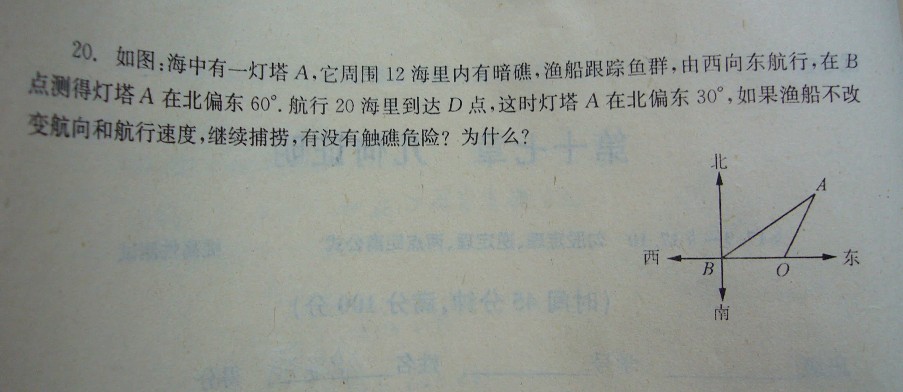

# 一道简单的数学题
2009-01-26

如图，又看不清地问我，万分感谢大家的帮助！

此题是锐角三角函数经典题（呵呵，不会三角函数也没关系，不用它也可以做的）由A点向下做垂线AE，看看△ABE，角B=30°，△AOE，∠AOE=60°∴∠ABO=∠BAO=30°∴BO=AO=20，（在直角三角形中，30°所对的角等于斜边的一半）∴在△AOE中，OE=10，再用勾股定理，AE=10倍根号3＞12所以无触礁危险。
