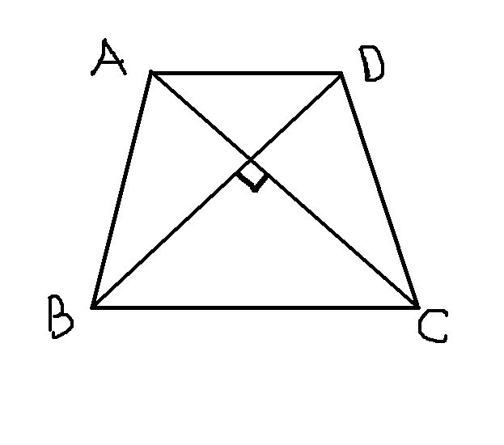

# 初二数学：梯形
2009-01-26

若等腰梯形ABCD  两对角线互相垂直AD平行于BC，且AC=8则等腰梯形ABCD的面积是多少？这题我想了好久，好难啊，谁帮帮我？

说一句：（1），等腰梯形的对角线相等，        （2），求任意一四边形的面积，若它的对角线垂直，则面积是对角线乘积的一半。用以上两个结论，问题迎刃而解，即二楼的解法。至于一楼，太麻烦了，还要作辅助线，完全没有必要。
