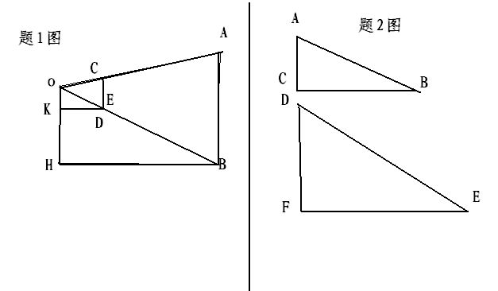
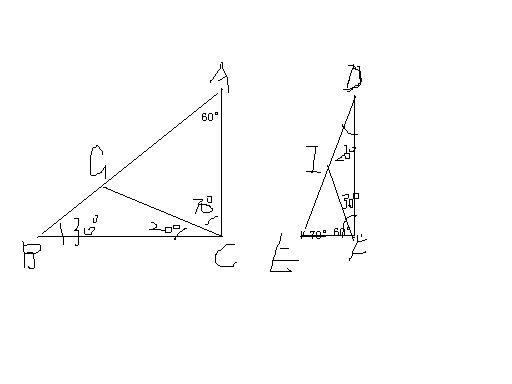

# 数学题：一个人OH拿着一支刻有厘米（详见补充）
2009-01-30

（1）一个人OH拿着一支刻有厘米划分的小尺CE，站在距电线杆AB约30m的前方，把手臂KD向前伸直，小尺竖直，看到尺上约12个划分恰好遮住电线杆，已知臂长KD约60cm，则电线杆AB的高为？（2）已知Rt△ABC和Rt△DEF不相似，其中角C，角F是直角，能否讲两个三角形分割成两个小三角形，使△ABC分成的每个三角形与△DEF分成的每个三角形分别对应相似？能的话，请设计一种分割方案；不能则请说明理由。谢谢啦！好的追加分！图在这里：

（2）图以作成，假设∠D=20°在△ABC中作∠BCG=20°；假设∠B=30°，在△DEF中作∠DFI=30°，这样△BCG∽△FDI，△CAG∽△EFI。（1）用比例——12：60=AB：3000AB=600cm=6m

