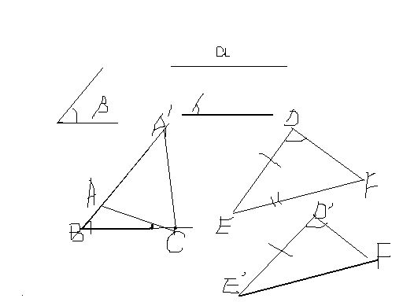

# 初二问题提问
2009-02-08

1.在三角形ABC与三角形A’B’C’中，AC=A’C’，BC=B’C’，∠ABC=∠A'B'C'<90度，证明：三角形ABC ≌三角形A'B'C'

是不是题抄错了，二楼说的对。SSA不可以的。 但也不是完全不可以，若这两个三角形SSA中A都是大于90°的角， 则就只有唯一一种情况。 即两三角形全等。 因此，如果把＜90°改成＞90°，才有答案的。 看看图，可能对你有帮助。 于是有这样一个结论：（课本没提到的） 当两个三角形两边及其一边对角对应相等时若所对的角是锐角，（如图），则可能出现两种情况，即不全等。而当所对的 角是直角或钝角，两三角形一定全等，对应的是直角时就是HL证全等。

