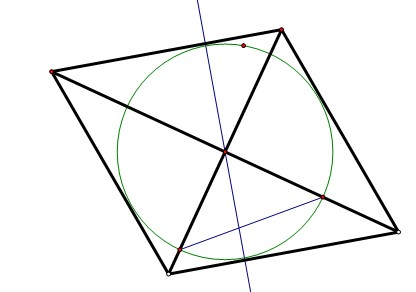

# 数学题呀
2009-02-14

要在一种对角线分别为30厘米和40厘米的菱形铁片余料中裁减一个圆,则圆的最大半径为多少

呵呵，看看图就会了，如图，最大圆以做出，以对称中心为圆心。向菱形一边做垂线，垂足到圆心就是半径，这个圆是最大的。（这是根据切线的性质菱形一边所在的直线相当于圆的切线。）注意菱形对角线垂直，又做RT△高（忘了标字母）用面积法求半径，即！15*20=r*菱形边长（可以算出是25）所以r=12

