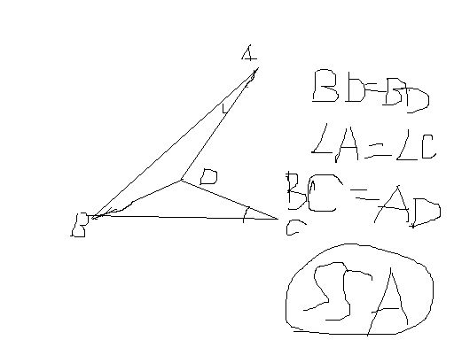

# 一组对角及一组对边相等的四边形是不是平行四边形
2009-03-21

如题。其实已经证出它不是了，但举不出反例。麻烦告诉一下反例怎么画谢谢。

我记得我们老师以前也讲过这题，但同样没举出反例，只是让我们课下思考，最麻烦的是对角而不是邻角，比如，你可以假定这组对角是50°等，那两角就是260的和，想想都是钝角，我觉得得是凹四边形，其中有一个内角大于180°，虽然我说不出个所以然来，但直觉告诉我，这是对的。不过我不会画，下面是我的简图，见笑了。

