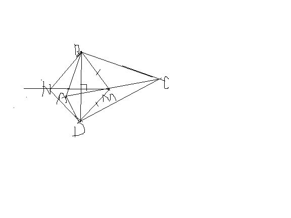

# 如图，四边形ABCD中，∠B=∠D=90°，M为AC的中点，BN‖MD且MN⊥BD。求证：四边形BNDM菱形
2009-04-04

快啊~~给加分100

证明如图，在Rt△ABC与RT△ADC，AC是它们的公共斜边，所以它们斜边上的中线相等，即BM=DM，△BDM是等腰三角形，所以BD与MN交点（设为O）是BD的中点，即BO=DO，还有一条件是BN‖MD，可以证△BNO全等于△DMO，（AAS），所以MO=NO，对角线互相垂直平分的四边形是菱形，即可得证。

