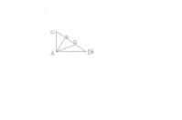
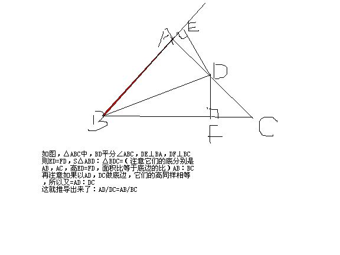

# 在三角形ABC中,点D、E在边BC上，角CAE=角B，E是CD的中点，且AD平分角BAE
2009-04-12

BD=AC吗

BD=AC理由，∵AD平分∠BAE，所以S△EAD ：S△BAD=ED/BD=AE/AB（这是有关角平分线的性质）又∵∠CAE=∠B，∠C是公共角，∴△CAE∽△CBA（AA）则AE/AB=CE/AC（对应边成比例）∴ED/BD=CE/AC，∵CE=DE，∴BD=AC关于第一个角平分线的性质，看图说话。

