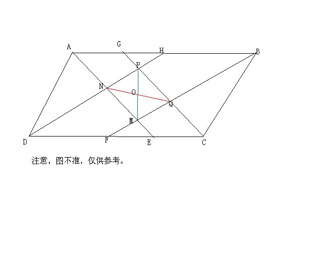

# 初二数学证明题
2009-05-03

1.如图，已知AE,BF,CG,DH分别平分平行四边形ABCD的内角∠A，∠B,∠C,∠D,点M,N,P,Q是角平分线的交点求证：NQ=AB-AD如果四边形ABCD是矩形，试判断四边形MNPQ的形状并加以证明2.如图，将含45°的两个全等的直角三角板△ABC,△DEF如图放置，使AC‖DF若EC=1/2AE，求矩形BHEG的面积：平行四边形ADFC的面积3.如图，已知在矩形ABCD中，∠BAC，∠BCA的角平分线交于点E，作EF⊥AD于F，EG⊥DC于G，若矩形ABCD的面积=64，求矩形DFEG的面积我的级数不够 那位的图字母标错了，图是对的

这三个不是一道题吧？好歹我把第一题图画出来了，二三实在不好思考，我看也都不简单。第一问其实并不简单：因为DH平分角ADC——∠ADH=∠HDC因为AB‖DC，所以∠HDC=∠AHD所以∠ADH=∠AHD 即三角形ADH是等腰三角形。所以AD=AH，AB-AD=HB下一步就是证明HB=NQ了，反正我花了极大时间算的，同理BG=BC，因为AD=BC，所以AH=BH，因为∠ADC=∠ABC，所以∠HDF=∠HBF，又HB‖DF，即∠BHD=∠HDF 所以∠HBF=∠BHD，所以DH‖FB，所以HDFB是平行四边形。所以∠AHN=∠GBQ，同理AECG是平行四边形，∠HAN=∠BGQ，两角夹边得△AHN≌△GBQ，所以HN=BQ，又HN‖BQ，所以HNQB是平行四边形，所以HB=NQ。上面忘了说了，如果ABCD是平行四边形的话，角平分线是垂直的，也就是说，四边形MNPQ是矩形。现在又加了一个条件，ABCD成了矩形。此时一猜就有MNPQ是正方形，只要证明它是菱形即可，只要证出它PN=PQ即可。现在你把所有的45°角写出来，找出相等的边。所以由一问得，HN=BQ，又BQ=GQ，所以HN=GQ，又GP=HP，所以PN=PQ。以上就是第一题的解答，至于2，3，再说吧。

