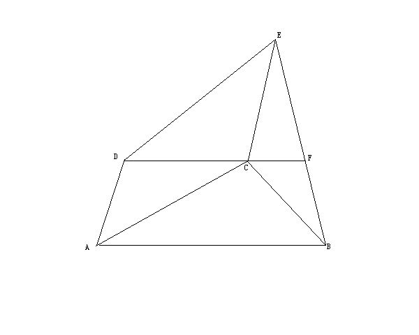

# 初二数学题
2009-05-03

已知，在四边形ABCD和平行四边形ACED，若DC‖AB，延长DC交BE于点F，求证：EF=FB

图:

延长EC交AB于M，因为EM‖AD，DC‖AM，所以四边形DCMA是平行四边形，则AD=MC，又因为DACE是平行四边形，所以AD=CE，所以MC=CE，在三角形EMB中，因为CF‖BM，C又是EM的中点。所以CF是三角形EMB关于MB边上的中位线，从而得出EF=FB。
