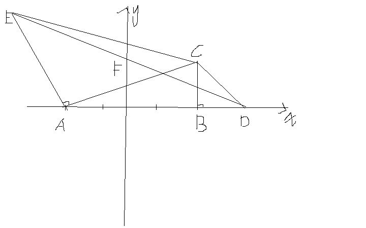

# 在rt三角形abc中。∠ABC=90°,∠BAC=30°,A(-2,0),B(2,0)。分别以BC、AC为边做等腰直角三角形
2009-05-04

分别以BC、AC为边做等腰直角三角形CBD,CAE，连接DE。求DE与y轴交点F的坐标。

题目，求F点的坐标。 因为A（-1，0）B（2，0）所以AB=4 过E作x轴的垂线，垂足为G，易证△AEG≌△CAB 所以AG=BC=4/根号3=4/3倍的根号3 EG=AB=4 设OF=a S△DEG可表示为1/2*EG*GD 又 S△DEG= S△DOF +S梯形GOFE=1/2*OF*OD+1/2*（EG+OF）*OG 可列方程为（消掉1/2） 4*2*（4/3倍的根号3 +2）=（4+x）（4/3倍的根号3 +2）+x*（4/3倍的根号3 +2） 再消掉4/3倍的根号3 +2，得x=2 所以F点的坐标为（0，2）
