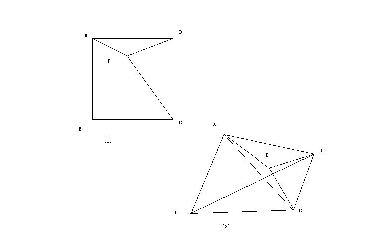

# 初二数学问题
2009-05-10

1.（1)正方形ABCD内一点P，PA=1，PB=2，PC=3，如果将△PCD绕D点顺时针旋转90°，能较快的求出∠APD的度数，试试看。(2)学习第（1）问的方法解决下面的问题：四边形ABCD中，AB=AC，∠ABC=60°，若点E是四边形内一点，且∠AED=120°，求证：EA+ED+EC≥BD。

你发的这两道题和旋转有关，都需要做辅助线解决。其中第一题已经司空见惯，只需要把△APD绕着A点顺时针旋转90°，再连接P与其对应点。 （答案：135°）第二题和一个重要的性质有关，由题意知三角形ABC是等边三角形。在三角形外部任取一点E，并连接AE、CE；再“任取一点”D，连接AD，BD，CD。现在可以证出来，AE+CE+DE＞BD。 也是旋转的方法，将三角形AEC绕着点A逆时针旋转60°得到△APB，连接PE。 则△APE也是等边三角形（AP=AE，∠PAE=∠BAC）。AE+CE+DE=PE+BP+DE，根据两点之间，线段最短，所以BD要小于从B到P，再到E，才回到D的距离。 这里有一个问题，∠AED=120°这个条件没用上。 实际上，我们只证出EA+ED+EC＞BD的情况，还有一个等号呢？ 当∠AED=120°，PED三点共线（∠AEP=60°，∠AED=120°，合起来180°），但不能保证BPED四点共线，也就是说如果再加上一个条件∠AEC=120°。那么EA+ED+EC等于BD，这时BPED四点共线！ 因此，我认为∠AED=120°是多余的，要告诉就要说∠AEC=∠AED=∠CED=120°（周角） 第二题和一个重要的性质有关，即在△ABC中，若在三角形内存在一点P（本题是三角形ACD），使三个顶点到P的距离最短，那必有这个点P与三个顶点交角为120°。证明就是上面的步骤。特殊的，当这个三角形是等边三角形时…… 且边长是1，AP+BP+CP=根号3！！！ 我说的这个性质就是旋转一类题型的最难的考点，万变不离其中，加油吧！
