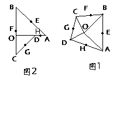
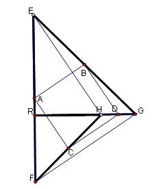

# 已知三角形AOB与三角形COD都是等腰直角三角形,固定三角形AOB将三角形COD绕点O旋转
2009-05-27

已知三角形AOB与三角形COD都是等腰直角三角形,固定三角形AOB将三角形COD绕点O旋转，E,F,G,H分别是AB.BC,CD,DA的中点。1。如果转至角AOB和角COD的两边如图1所示两边不共线的位置，判断四边形EFGH斯怎样的四边形。2。如果转至角AOB和角COD的两边如图2所示两边共线且一边方向相反的位置，情况如何？

实际上，图二是凹四边形的情况，图一是凸四边形，这还是有关中点四边形的性质，它们都是平行四边形，选用等腰RT三角形使题目变难，这时的平行四边形成了正方形了。证明，以第一问为例（字母不太一样），第二问一样的方法的：如图，连接四边形EFHG的对角线EH、FG，并延长EH交FG于K。先证△ERH与△GRF全等，（SAS）——ER=GR，∠ERH=∠GRF，RH=RF得到EH=FG，且∠REH=∠RGF，∵∠REH+∠GEH+∠EGR=90°，∴∠RGF+∠GEH+∠EGR=90°，∴∠EKG=90°。∵C是HF的中点，D是HD的中点，所以CD平行且等于1/2FG，又∵A是EF中点，B是EG中点，∴AB平行且等于1/2FG，∴AB平行且等于CD，∴四边形ABCD是平行四边形；又AB⊥EK，∴∠BDC=90°，∴四边形ABCD是矩形；又BD平行且等于1/2EH，又EH=FG，∴BD=AB，∴四边形ABCD是正方形。图上K点我没标出来，希望你给标一下。

