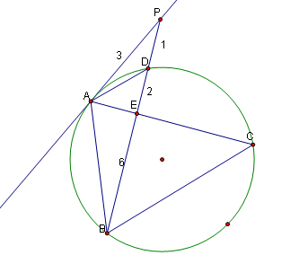

# △ABC是圆O的内接三角形,PA是圆O的切线,PB交AC于点E,交圆O于点D,若PE=PA,∠ABC=60度,PD=1,BD=8,则BC=__
2009-05-28

急用，要详细过程，谢谢了！！！！！！！

先用切割线定理，AP^2=PD*PB=9,∴AP=3=EP，从而求出DE=2，BE=6连接AD，则△ADP∽△BAP，∴AD/AB=PD/PA=1/3，∴AB=3AD，又ABCD四点共圆，∴AD/BC=DE/BE=2/6，∴BC=3AD，∴AB=BC，又角ABC=60°∴△ABC是等边三角形。利用BE是△ABC的四等分点且为6来解△ABC。可以用勾股定理，作BM⊥AC，交AC于M，设BC=x，ME=1/4x，BM=根号3/2x，斜边为BE=6，根据ME^2+BM^2=BE^2，求得x=29.25。不知对不对。

