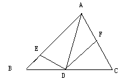

# △ABC，AD是角A的平分线，E.F分别是AB AC上的点 且角EDF+角BAF=180°证明DE=DF
2009-06-02

过程写仔细一点，谢谢

需要做辅助线，建议在AB边上做AG=AF，这样是为了得到DG=DF的，再证DE=DG即可得证。下面给出证法：∵四边形AEDF内角和是360°，且∠EDF+∠BAF=180°。∴∠AED+∠AFD=180°在AB上截取AG=AF，∵∠GAD=∠FAD，AD=AD，∴△AGD≌△AFD（SAS）∴DG=DF，∠AGD=∠AFD∴∠AGD+∠AED=180°∵∠AGD+∠EGD=180°，∴∠AED=∠EGD，∴ED=GD∴ED=FD在这里巧妙的利用GD一线，这也是解决角平分线常用技法。以角平分线为对称轴，构造全等三角形。
