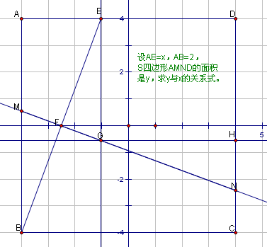

# 初二数学问题求解
2009-06-23

如图，在正方形ABCD中，AB＝2，E是AD边上一点（点E与点A，D不重合）． BE的垂直平分线交AB于M，交DC于N.（1）设AE＝x，四边形ADNM的面积为S．写出S关于x的函数关系式；

回答：S=-1/2x^2+x+2方法，四边形ADNM是个等腰梯形，且高为2，（AD=2），根据梯形面积公式，S=1/2*AD*（AM+DN）=AM+DN。所以要求梯形面积只要算出AM长是多少，DN得多少，加起来就可以了。这并不容易：首先MN⊥BE，可以证△ABE∽△BFM，得到BM/BE=BF/BA=MF/AE。∵AB=2，AE=x（x≠0或2），根据勾股定理，BE=根号下（4+x^2）又∵F是BE的中点。∴BF=1/2根号下（4+x^2），这样根据比例式可算出BM=1+x^2/4,MF=1/4*x*根号下（4+x^2）这样AM=2-BM=1-x^2/4。下面来算DN，我做了辅助线，过E作EG‖AB交MN于G点，再过G作GH‖BC交CD于H，则DN=DH+HN。由已知条件可证：△MBF≌△GEF（两角一边）∴EG=MB=1+x^2/4，GF=MF=1/4*x*根号下（4+x^2）也可证EGHD是矩形。∴GH=ED=2-x。注意∠EGF与∠HGN互余，∠HGN与∠HNG互余，利用这种关系得：△EFG∽△GHN用对应边来比，FG/HN=EF/GH可求得HN=x-1/2x^2.∴DN=EG+HN=x+1-1/4x^2∴S=AM+DN=-1/2x^2+x+2修改答复：我的方法有点麻烦，在求DN长可以简化一下：∵ AM=1-x^2/4，过M点作MT⊥CD，则△MTN≌△BAE，这样DN=DT+TN=AM+AE=1+x-1/4x^2（和上面是一样的，步骤简单了些）下面再提供一种解析几何的方法供参考。这个图我把平面直角坐标系已经画出来了。还是求AM，DN的长的思路。以正方形ABCD的中心O（自己标一下）为坐标原点，过O且平行AD的直线为x轴，过O且垂直AD的直线为y轴。这样就建立坐标系，这里为了和点的横坐标x区别开，设AE=h（一会你在换回去）这样A（-1，1）B（-1，-1）C（1，-1）D（1，1）E的坐标可求，（h-1，1）而B（-1，-1）。由于直线MN是线段EB的中垂线，则直线MN上点P满足|PE|=|PB|利用两点间的距离公式得：（x-h+1）^2+(y-1)^2=(x+1)^2+(y+1)^2化简就是直线MN的方程（解析式也行）2hx+4y+2h-h^2=0直线AB：x=-1，两直线交点M的坐标可求：联立解析式为二元一次方程组解得y=h^2/4同理直线CD：x=1.N点纵坐标为h^2/4-h这样AM，DN可求，AM=1-h^2/4,DN=h-h^2/4+1和平面几何的做法是一样的，只不过没用到什么相似全等的知识，完全是代数变换。

