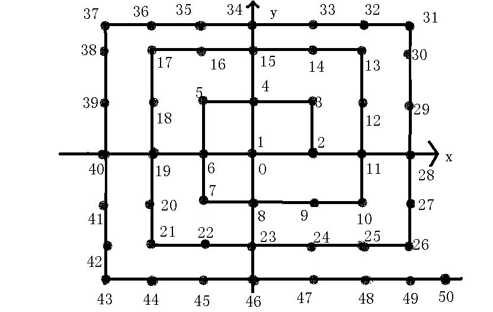

# 初三数学
2009-08-22

将正整数按如图中的规则排列，每个正整数对应一个坐标，如数3对应（1，1），请问1993对应的坐标是什么？

很有趣的找规律的题目。我的方法是这样的：首先注意这样一组数：1，9，25，49……在图上可以标一下。无一例外，它们都是最右下角的一组数，把它们连起来并继续延长，这是一条射线，上面点的横纵坐标的绝对值都相等。也就是说，1这个点坐标是（0，0），9（1，-1），25（2，-2）……而1是1的平方，坐标是（1-1）/2=0；9=3*3，坐标是（3-1）/2=1；25=5*5，坐标是（5-1）/2=2……1849=43*43，坐标是（43-1）/2=22大体估算出1849的坐标是（22，-22）2025的坐标是（23，-23）然后把图上的点连成正方形，也就是说，把2~9这八个点看做一个正方形，10~25也是如此。这样我们说，15这个点在25所在的正方形内。可以用减法来推15这个点的坐标。25的坐标是（2，-2），用25-（5-1）得到正方形左下顶点的坐标（-2，-2）的对应数值是21，同理推左上（-2，2）对应21-4=17的坐标17-4=13的坐标自然是（2，2）了。则15在13~17中间，纵坐标一定是2，横坐标用平移解决，需要将17这个点右移17-15=2个单位，横坐标-2为0.即15对应（0，2）。同理推1993的对应坐标，它应该在2025所在的正方形内[2025是正方形的右下顶点，坐标是（23，-23）]2025-（45-1）=1981,这是左下顶点（-23，-23）1993在1981~2025中，纵坐标为-23，横坐标是1981这个点右移1993-1981=12，即-23+12=-11所以1993对应（-11，-23）PS：如图所示的正方形的四个顶点的坐标的绝对值都是一样的，正负号要看象限，也就是平常说的关于x轴（y轴）对称的点的坐标之类。
