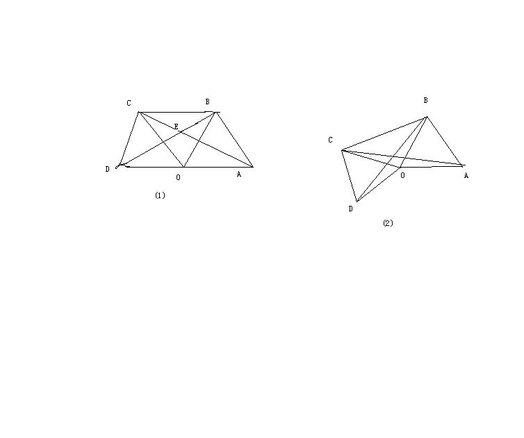

# 初二数学问题
2009-08-26

如图（1），点O是线段AD的中点，分别以AO和DO为边在线段AD同侧作等边三角形OAB和等边三角形OCD,连接BC，求∠AEB的大小；如图（2）△OAB固定不动，保持△OCD的型状和大小不变，将△OCD绕着点O旋转（△OAB和△OCD不能重叠）。求∠AEB的大小。

第一题的答案是60°。先猜想，一般这种题答案无非是特殊的角。再证明，设AC与OB的交点是R，观察△REB与△AOR，有一对对顶角，∠EBO又=∠RAO是由于△DOB≌△COA。所以∠AEB=∠BOAt=60°第二题∠AEB的度数始终不变=60°。证法同上，无非是在△DOB≌△COA有些许变化。
