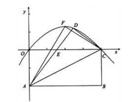

# 【初中数学】求教
2010-04-11

如图，四边形OABC是矩形，OA=4，OC=8，将矩形OABC沿直线AC折叠，使点B落在D处，AD交OC于E。(1)求OE的长。(2)求过O,D,C三点抛物线的解释式。(3)若F为过O,D,C三点抛物线的顶点，一动点P从A出发，沿射线AB以每秒1个单位长度的速度匀速运动，当运动时间t（秒）为何值时，直线PF把△FAC分成面积之比为1：3的两个部份?

（1）求OE的长可以借助勾股定理列方程。先证△OAE≌△DCE（AAS）得到：AE=CE。设OE=x，OC=8，所以AE=CE=8-x，AO=4。x^2+4^2=(8-x)^2.解得：x=3。所以OE=3（2）要求抛物线的解析式必须先求D点坐标。由第一问知道DE=OE=3，CE=8-OE=5，CD=4。过D点作DM⊥OC于M。则△DEM∽△DEC（AA）所以DM/DC=DE/CE=EM/DE，解得：DM=12/5；EM=9/5。所以D点坐标为：（24/5，12/5）。因为抛物线过（0，0）（8，0）所以设抛物线解析式为：y=ax（x-8）……{交点式}将D点坐标带入，解得：a=-5/32所以，过O、D、C三点的抛物线解析式为：y=-5/32x^2+5/4x……{一般式}(3)过F作FN⊥AB于N，交AC于Q。设PF交AC于R由抛物线的对称性可知Q是AC的中点。所以FP把△FAC的面积二等分。此时分两种情况讨论：①当S△ARF=1/3 S△FRC此时AR=RQ。可以用几次相似三角形求出t的值。由抛物线的解析式可知，F（4，5/2）。所以FN=6.5，AN=4过R作RG⊥AB于G，则G是AN的中点，AG=GN=2。由△ARG∽△ABC得：RG/4=2/8，所以RG=1；由△RPG∽△FPN得：PG/（PG+2）=1/6.5，所以PG=4/11，所以AP=2-4/11=18/11，即t=18/11。②当S△ARF=3 S△FRCR是CQ的中点。过R作RH⊥AB于H，则H是PN的中点。所以，NH=2，AH=6。由△ARH∽△ACP得：RH/4=6/8。所以RH=3；由△PRH∽△PFN得：3/6.5=PH/（PH+2），所以PH=7/12。所以AP=4+7/12=55/12,即t=55/12。说明，由于辅助线添加的过多所以可能楼主理解起来有困难，故发3张图。

