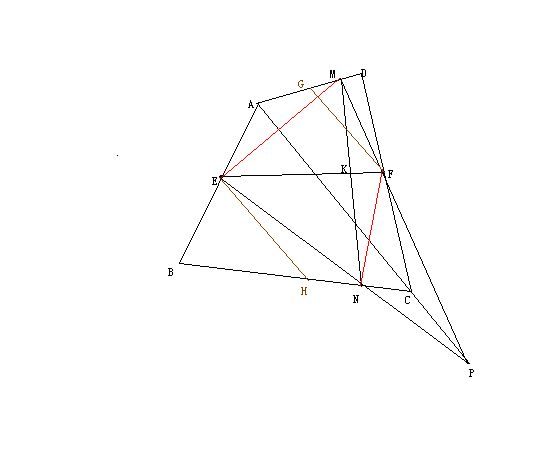

# 智者请进！初二数学难题！！！
2010-05-08

如图，四边形ABCD中，E,F分别是AB,CD的中点，P是对角线AC延长线上的任意一点，PF交AD于M，PE交BC于N，EF交MN于K，求证：K是MN的中点。图片地址：http://pic.wenwen.soso.com/p/20100508/20100508121558-712209907.jpg

如图，过F作FG‖AP交AD于G，过E作EH‖AP交BC于H，连接EM，NF。①因为F是CD中点，所以FG是△ADC中位线，GF=1/2AC；同理EH=1/2AC。所以GF=EH②因为GF‖AP，所以MF/MP=GF/AP，FP/MP=（AP-GF）/AP。③因为S△EMP/S△EMF=MF/MP，所以S△EMF=S△EMP*MF/MP=S△EMP*GF/AP④因为EH‖CP，所以EN/NP=EH/CP所以EN/CP=EH/（EH+CP）。⑤因为S△ENF/S△EFP=EN/EP，所以S△ENF=S△EFP*EN/EP=S△EFP*EH/（EH+CP）S△EFP=S△EMP*FP/MP=（AP-GF）/AP，所以S△ENF=S△EFP*（EH/AP）*（AP-GF）/（EH+CP）。因为AP-CP=AC=GF+EN所以S△ENF=S△EFP*（EH/AP）⑥所以S△EMF/S△ENF=1，即S△EMF=S△ENF。⑦因为S△EMK/S△ENK=MK/NK，S△FMK/S△FNK=MK/NK，所以（S△EMK+S△FMK）/（S△ENK+S△FNK）=MK/NK即S△EMF/S△ENF=MK/NK所以MK=NK，K是MN的中点用到的知识：中点四边形，中位线，平行线分线段成比例，共边定理等。

