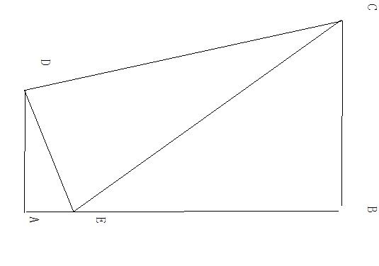

# 初二数学题  有点晕。。。。。
2010-05-23

如图 四边形ABCD中，AD垂直于AB   AB垂直于BC，BC=2AD，DE垂直于CD交AB边于E，连接CE  ，请找出DE AE CE之间的等量关系并证明图在这

本题关键是证明△ADE∽△CDE，取CB的中点F，连接DF，因为BC=2AD，所以BF=AD，又因为BF‖AD，所以四边形ABFD是矩形，所以角ADF=90°，DF‖AB。设DF交EC于G，则G是EC的中点，所以DG是RT△DEC斜边上的中线，所以DG=GC，所以角C=角CDG，又因为角CDG=90°-∠GDE=∠ADE，∠A=∠CDE=90°所以△ADE∽△CDE所以DE/AE=CE/DE即DE^2=AE*CE
