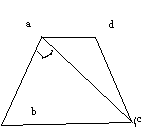

# 一道超难的数学题
2010-06-05

在梯形abcd中 ad‖bc ab⊥ac 角b=45° ad等于根号2 bc=4根号2 求dc的长如图

过A，D（表示点的字母一定要大写）作BC的垂线，垂足为E、F。由题意可知△ABC是等腰直角三角形，所以AE=BE=CE=2根号2；因为四边形AEFD是矩形，所以EF=AD=根号2，DF=AE=2根号2所以CF=BC-EF-BE=根号2 在RT△DFC中，由勾股定理得：CD=根号10。
