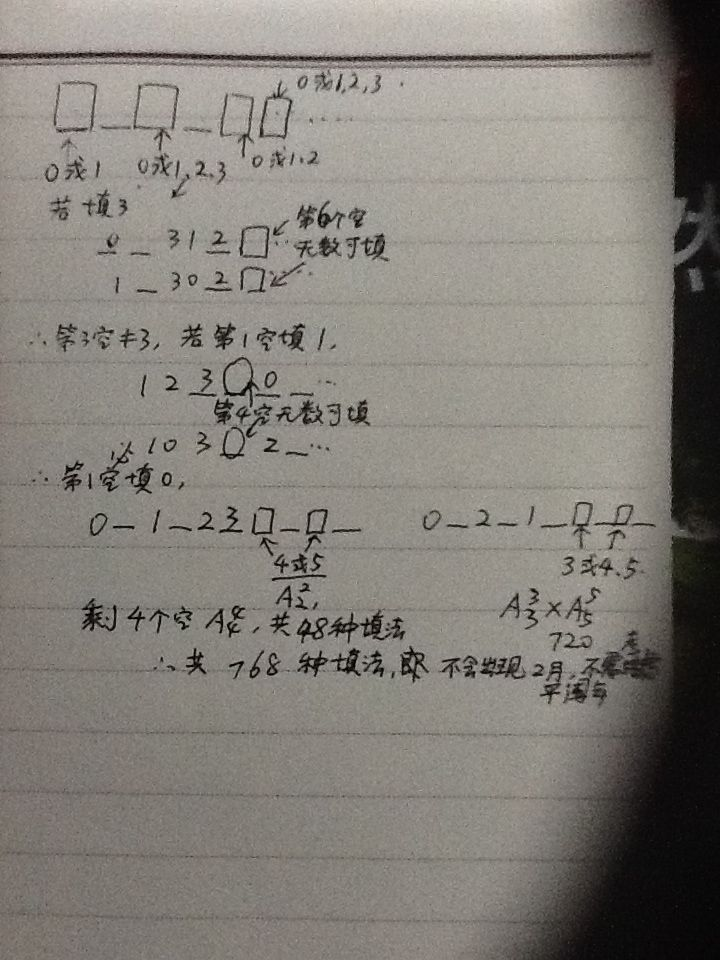

# 假如电子计时器所显示的十个数字是“ 0126093028”这样一串数，它表示的是 1月26日9时30
2013-07-25

假如电子计时器所显示的十个数字是“ 0126093028”这样一串数，它表示的是 1月26日9时30分28秒。在这串数里，“ 0”出现了3次，“2”出现了2次，“1”、“3”、“6”、“8”、“9”各出现1次，而“4”、“5”、“7”没有出现。如果在电子计时器所 显示的这串数里，“0”、“1”、“2”、“3”、“4”、“5”、“6”、“7”、“8”、“9”这十个 数字都只能出现一次，称它所表示的 时刻为“十全时”，那么2003年一共有（ ）个这样的“十全时”

应是24小时制，

