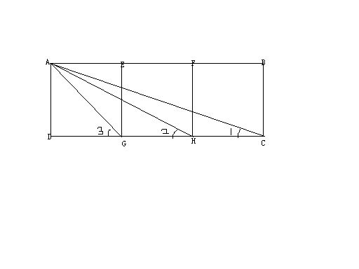

# ∠3=∠1+∠2？
2009-01-31

如图所示，矩形ABCD中，G，H是CD的三等分点，E，F是AB的三等分点，连接EG，FH。且AD=DG（以上条件就是说矩形被分成三个正方形）。再连结AG，AH，AC，试证明∠3=∠1+∠2.大家有没有什么好的方法，谢谢各位！∠3=∠AGD∠2=∠AHD∠1=∠ACD

简单欲证∠3=∠2+∠1只需证∠GAH=∠1这需要证相似。即证△GAH∽△GCA我们可以求出它们三边长度发现成比例，问题可解。
