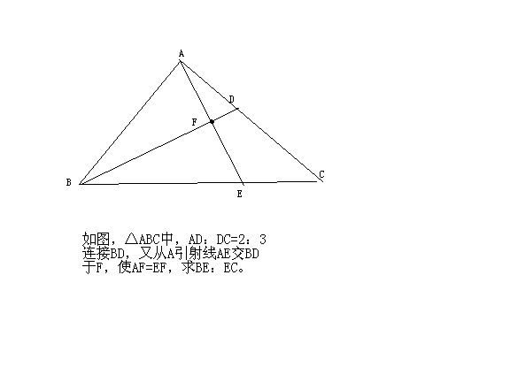

# 小学六年级的几何题
2009-04-21

题都在图上了，现在我在读初中，一个偶然的机会翻出了以前的数学资料（尖子生题库），那时却也刻苦，都写的满满的，当时不会的，也是囫囵吞枣过去了，可我至今对这一类型的题目仍然不解，下图就是一个典型。那时的几何也就是求阴影部分的面积一类，边长比一类特别常见，各位网友一起看看这图，应该怎么办？也真是难为小学生了……最好可以用初中的方法解一下，至于小学时的算术思想与头脑，都已经被现在的方程式所取代，做几何题也不能像以前那样随意……满意还有悬赏。

定理:(1)等底同高的三角形面积相等(2)同高的三角面积之比,等于底长之比解:连结DE,设三角形ADF面积专为单位"1"因为AF=EF所以,ADF面积=DEF面积=1,ABF面积=BEF面积因为AD:DC=2:3所以,ABD面积:CBD面积=2:3ADE面积:CDE面积=2:3,CDE面积=3BE:EC=ABE面积:ACE面积=DBE面积:CDE面积ABE面积=ABF面积+BEF面积=2×BEF面积DBE面积=BEF面积+DEF面积=1+BEF面积2×BEF面积:(1+1+3)=(1+BEF面积):3BEF面积=5所以:BE:EC=10:5=2:1这小学奥数,有点难.初二奥数也不过如此.以上解题所用知识属,也是小学六年级的知识.
