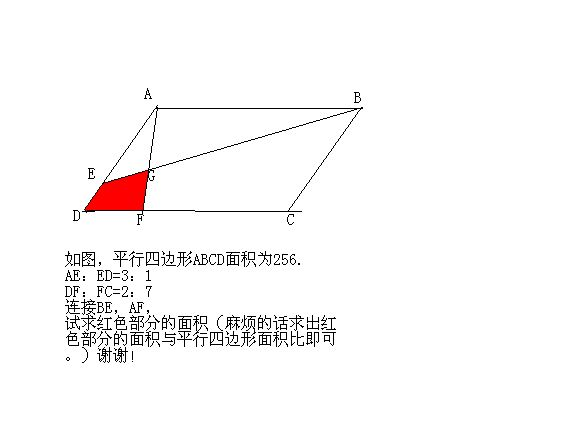

# 平行四边形中求阴影面积
2009-04-21

如图啦，剩下的就是麻烦大家了。

延长百BE，CD交于M MD/AB=1/3 MF/AB=MD/AB+DF/AB=1/3+2/9=5/9 S△度EDM/S△AEB=(1/3)^2=1/9 S△AEB/SABCD=1/2*3/(3+1)=3/8 S△EDM/SABCD=1/9*3/8=1/24 S△GFM/S△AGB=(5/9)^2=25/81 S△AGB/SABCD=1/2*9/(5+9)=9/28 S△GFM/SABCD=25/81*9/28=25/252 S阴影/SABCD=S△GFM/SABCD-S△EDM/SABCD =25/252-1/24=29/504 S阴影=29/504*256=32*29/63=928/63 应该没有算问错答！！！
