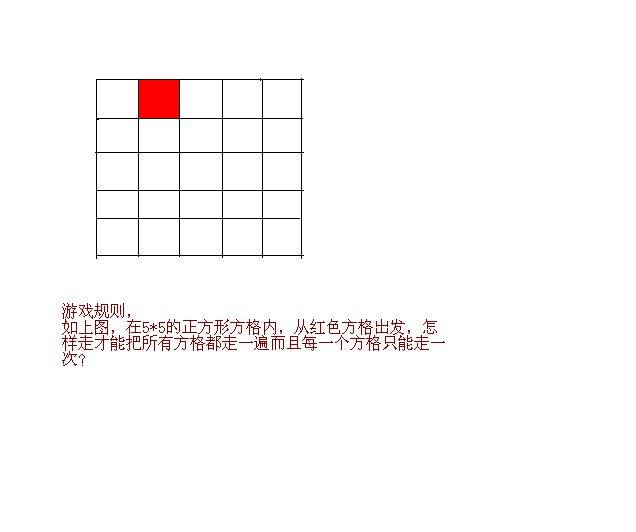

# 一道智力数学题，高手来！
2009-05-13

这道题班里同学也讨论了很长时间，都无果而终。当然，这个出发点是有讲究的，如果换一下似乎很容易。我认为它没结果，所以我想问大家一下，究竟有没有方法可以只走一遍，如果有，给出方法；如果没有，我特别想要理论证明。谢谢啦！

这个跟七桥问题应该无关。但是它确实是百无解的。原因就在于如果从上到下，度从左到右的进行标号的话，把25个格子都标上从1-25的数字。则有13个奇数，12个偶数。所以如果从一知个方格走到相邻的一个方格，必然两个方格上标号的奇偶道性不同。因此从偶数出发必然只能走12个偶数，12个奇数。从而有一个奇数的回格子没走到。当然如果你允许斜着走答的话，问题显然是有解得，我想你是不允许斜着走的。
