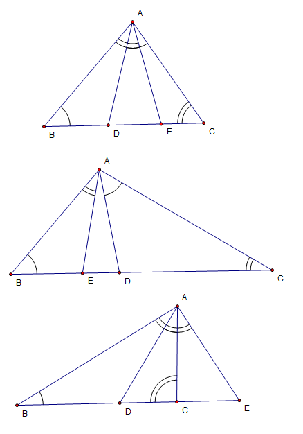

# 和相似三角形、等腰三角形有关的一道几何题
2009-06-12

一个三角形ABC，作∠CAD=∠B，交BC所在的直线于D且在C的左边；作∠BAE=∠C，交直线BC于E且在B的右边。AD总是等于AE吗？AD*AE等于BE*CD恒成立吗？什么时候ED^2=BE*CD注：上面的问题要根据∠A的大小作答。（取舍范围）谢谢大家了。题目本无图，因为需要分类。

这道题基度本上所有分类证法是相同的问AD恒等于AE：∠答AED=∠BAE+∠ABC;∠ADE=∠CAD+ACB而∠CAD=∠ABC;∠BAE=∠ACE所以∠AED=∠ADE,于是AE=ADAD*AE恒=BE*CD: △AED∽△内CDA当∠A=120°时容△AED是等边三角形AE=AD=DE此时ED^2=BE*CD

