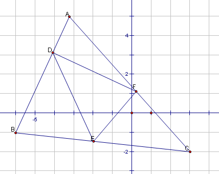

# 关于三角不等式的一道解答题
2009-07-02

在三角形ABC三边上存在DEF三个点构成△DEF。且AD/AB=BE/BC=CF/CA=k（k＜1/2）设△ABC的周长为p，△DEF的周长为q。试证明：q＜（1-k）p谢谢大家了！图在这里。

证明:在百AB,BC,AC上取点度X,Y,Z,使得BX/AB=CY/BC=AZ/AC=k显见:XE=kAC,YF=kAB,DZ=kBCXD=(1-2k)AB,EY=(1-2k)BC,ZF=(1-2k)AC (k<1/2)在三知角形DEX,EYF,DZF中，道有:DX+XE>DE,EY+YF>EF,DZ+ZF>DF也就回是:(1-2k)AB+kAC>DE(1-2k)BC+kAB>EF(1-2k)AC+kBC>DF三式相加答:(1-k)(AB+BC+AC)>DE+EF+DF也就是(1-k)p>q,得证
