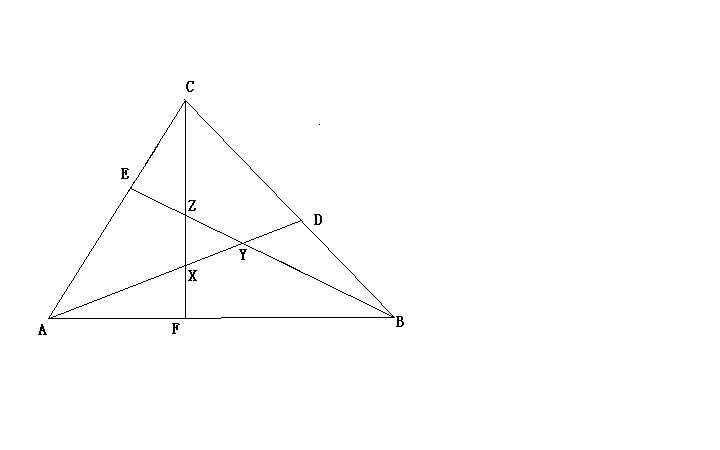

# 小学数学图形题求助
2009-07-30

一个三角形ABC，DEF三个点分别是BC、AC，AB上的点，而且AF/FB/=BD/DC=CE/EA=2/3。再连接AD，BF，CE，三条线段分别交于XYZ三个点。问，△XYZ的面积是△ABC面积的几分之几？

此题关键-----X、Y、Z三个点分别度是AD、BE、CF的几等知分点。用《平行线对应道边成比例》原理，可知内XYZ分别是19等分点。 传图给你。 既AX:XD=10:9 ,BY:YE =10:9CZ:ZF=10:9S△容AXC=S△BZC=S△AYB=S△ABC·3/5·10/19=6/19则S△XYZ=（1-6/19×3）·S△ABC=1/19·S△ABC

