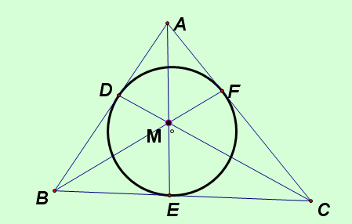

# 任意三角形ABC，内切圆切三边于DEF……（更多条件请点击，几何证明题）
2009-08-02

任意三角形ABC，内切圆切三边于DEF，连接AE，CD与BF。求证：AE，CD与BF三条线交于一点M。谢谢。PS：这是一个几何著名定理，不会证明。

AD，AF与圆相切，所以AD=AF，同理BD=BE，CF=CE所以，(BE/EC)*(CF/FA)*(AD/DB)=1由塞瓦定理逆定理只，AE,BF,CD三线共点。
