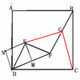

# 初三数学，几何证明题，高手赐教！
2009-11-25

如图：（1）在正方形ABCD中，连接对角线BD，E是BD上任意一点，过E点作BD的垂线交CD于点F，连接BF并取中点G。连接EG，CG。问：EG=CG，EG⊥CG吗？为什么？（2）如果将△DEF绕着D点逆时针旋转45°，使DE与AD重合，DF与DB重合，取BF的中点G，连接EG，CG 。问上述结论是否还成立。为什么？（3）如果旋转的角度是任意的，（1）中的结论还成立吗？为什么？图片地址：http://hi.baidu.com/%C3%CE%CF%EBn%B4%CE%B7%BD/album/item/273401427ff0d23e9313c65b.html（1图）http://hi.baidu.com/%C3%CE%CF%EBn%B4%CE%B7%BD/album/item/273401427ff0d23e9313c65b.html#IMG=d01dc2eedac4c7c0ce1b3e5b（2图）http://hi.baidu.com/%C3%CE%CF%EBn%B4%CE%B7%BD/album/item/273401427ff0d23e9313c65b.html#IMG=04f6d08a741cc8fcfd1f105b（3图）

⑴⑵是⑶的特百款。直接证明⑶。如图取坐标系，使D（0,0）度,C（知2,0）B（2,2）道,A（0,2）.设F（2a,2b）,则M（a,b）[DF中点]，N（-b,a）[正方形]E（a-b,a+b）.G（a+1,b+1）.CG斜率＝（专b+1）/（a-1）。  EG斜率＝（1-a）/（1+b）,∵[（b+1）/（a-1）]×属[（1-a）/（1+b）]＝-1    ∴CG⊥EG. CG&sup2;＝（a-1）&sup2;+（b+1）&sup2;. EG&sup2;＝（-b-1）&sup2;+（a-1）&sup2;.∵（a-1）&sup2;+（b+1）&sup2;＝（-b-1）&sup2;+（a-1）&sup2;.  ∴CG＝EG.

