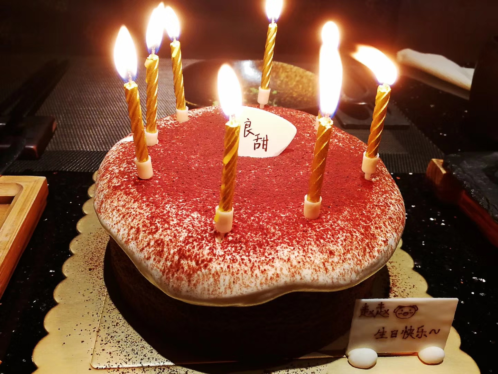
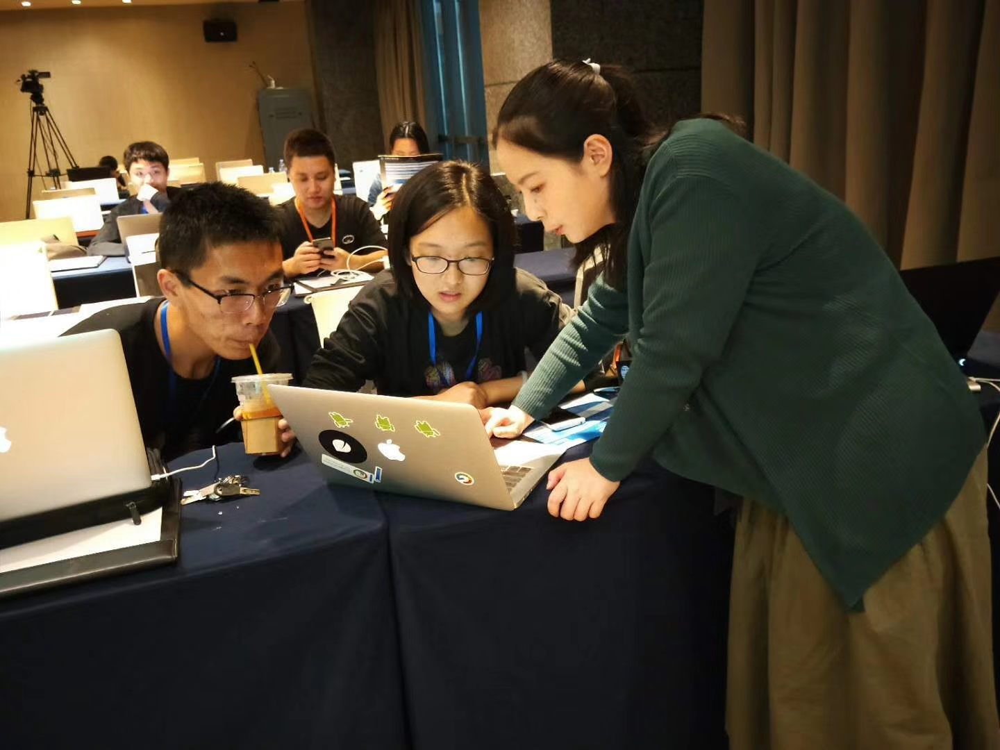
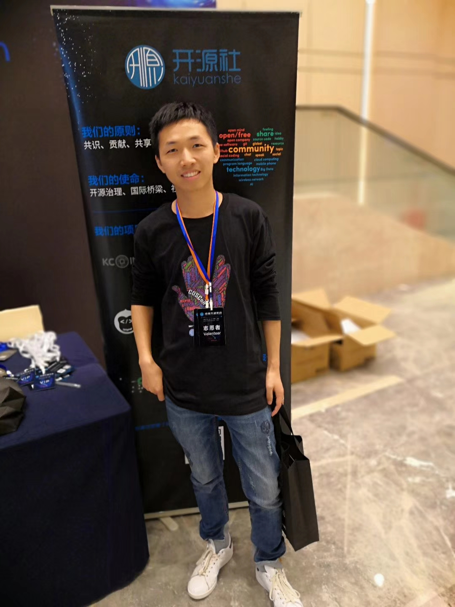

## 服务器
2018/4/10

实验室还没有计算服务器，下周要做数据挖掘课程的 mini talk,需要用 python 算一些东西，可能用时比较久，只能配置
自己工位上的工作站了。

## 要锻炼
2018/4/10
今天统计信号处理的廖老师说昨晚电子系又有一位老师英年早逝了，又举了其他的例子，嘱咐我们要加强体育锻炼，
我室友赵鹏阳说自己受到了惊吓。

## 要改掉的坏毛病
2018/4/26

<!--xiaoyuyu  -->
* 说话吸气
* 走路驼背

<!--赵鹏阳-->
* 随手关宿舍门、洗手间门和热水器
* 剪指甲等清洁不要直接弄到地板上

<!--戴暮云、赵原芳 -->
* 关于称呼，如A是B的师兄，在B面前要表现出对A的尊重，不能直呼其名，而应称为 A师兄。

<!--戴暮云、学工方面-->
* 装订形式、订左上角、用一个钉

<!--赵鹏阳-->
* 看脸的时代在面部护理上需要格外注意

## 谢谢喵喵陪我过24岁生日~
2018/7/11

## summary
2018/8/8

推送：海南儋州支教总结

## CosCon 2018
2018/10/21

百度 echarts 开发者教学

深圳北京同济华师高校代表

辅导员喻越

北大同学

另感谢高校组组长、南科大先进院志愿者及负责同学。

2018中国开源年会

## warm winter
2018/12/9

南燕青协携手南国紫荆，用暖冬温暖寒冬

推送：暖冬行动 | “暖冬有你，温暖同行” 志愿捐衣活动成功举行

## autism
2018/12/16

推送：活动进行时｜为星儿点灯

