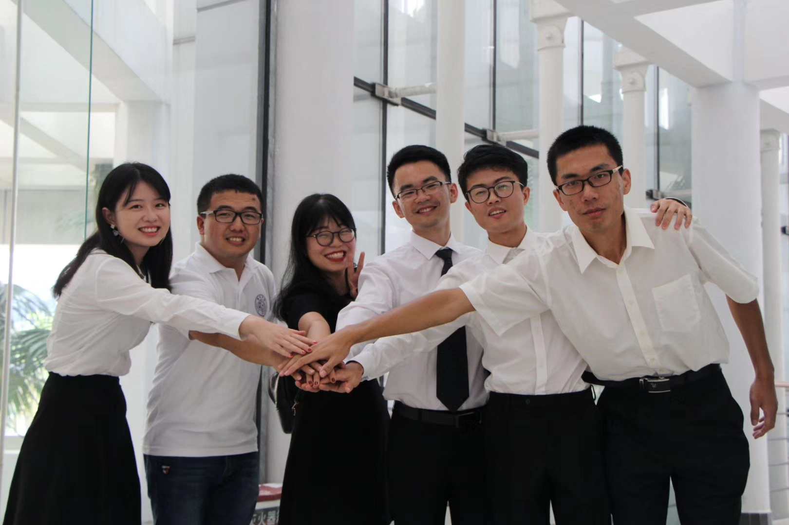
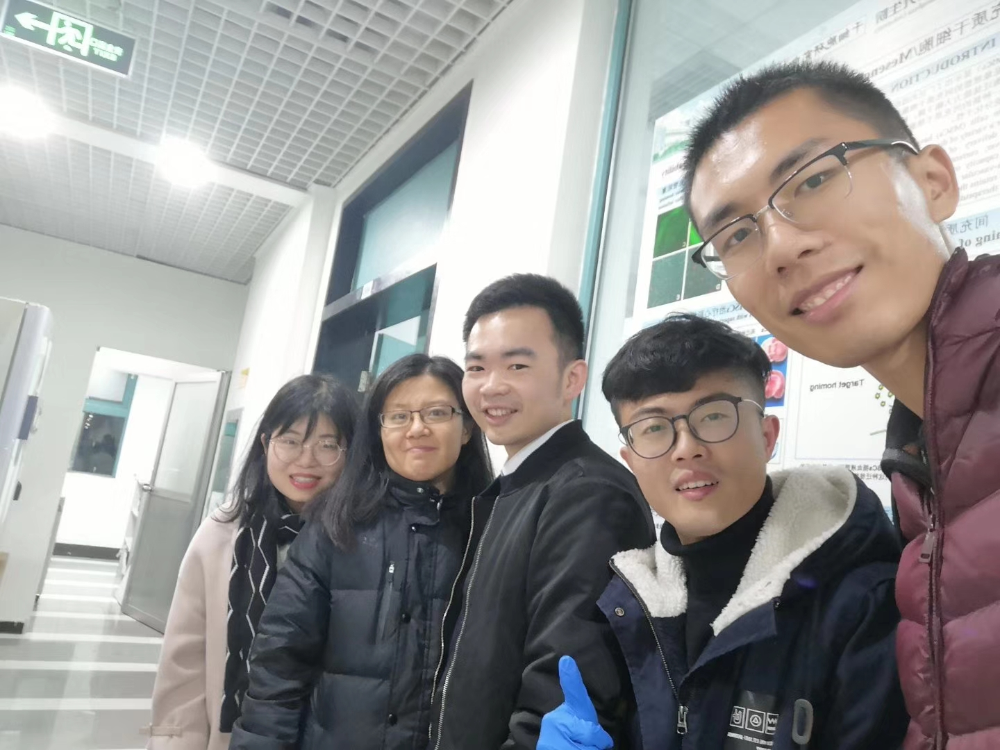
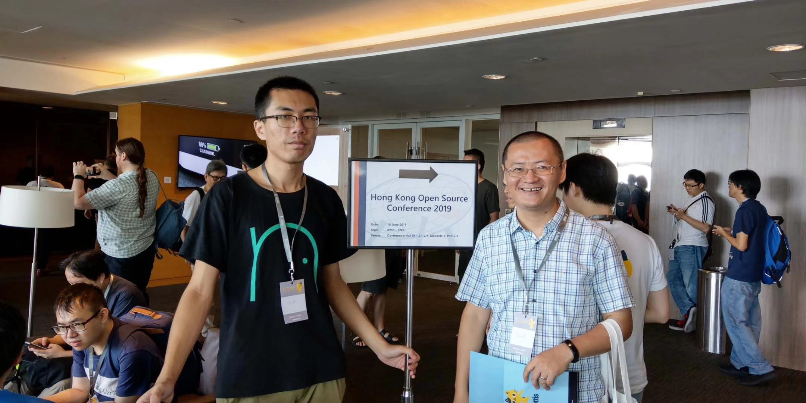
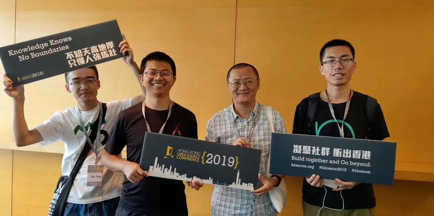
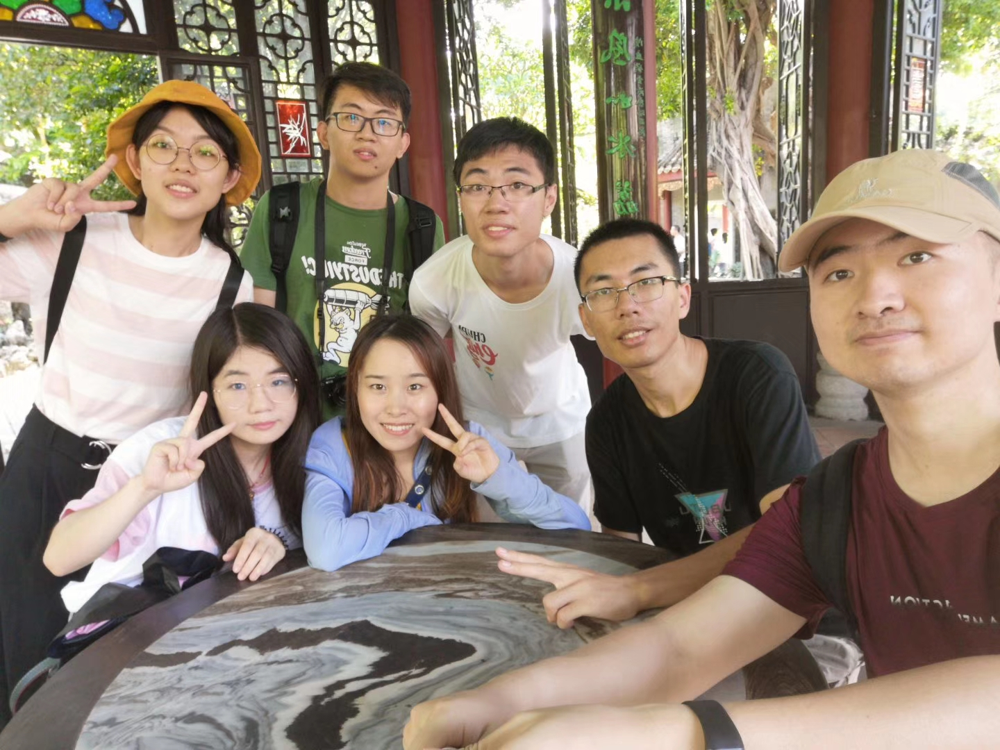
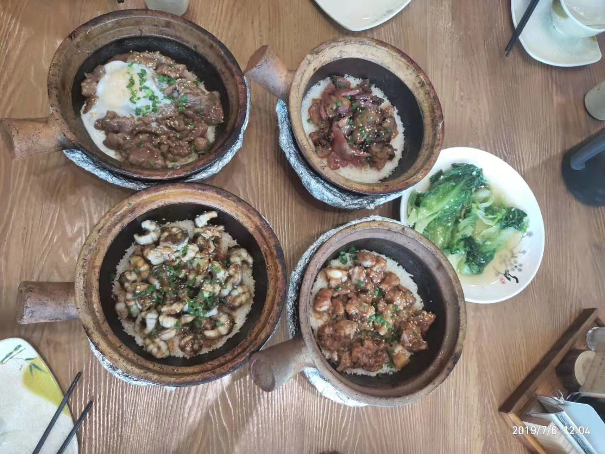

## Reunion
2019/1/3

自答辩结束暑期支教队难得再聚一次，感谢张晓冰带我们参观实验室小白鼠~

## Autism
2019/1/25

关爱星星的孩子，你也可以

推送：星语｜星之后裔，伴以情语

## Autism Second
2019/2/17

对于特殊群体，不应该止步于关心或者同情

推送：星语再出发 ｜ 新学期活动预告

## szlug
2019/2/24

推送：活动预告｜深圳 Linux 用户组线下分享会

## szlug second
2019/2/25

推送：互联网公益模式探索 ｜ 深圳 Linux 用户组第二次线下活动

## Autism Third
2019/4/2

推送：星路有你，益起同行

## HKOSCON
2019/6/15

有幸参加了2019HKOSCON，特别感谢闻兄的介绍，王兄的结伴。

## 打卡顺德
2019/7/6

