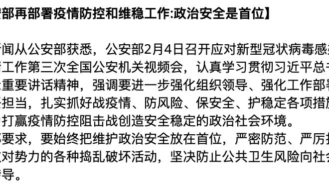

## Doctor 
2020/2/7

## Marriage and Babysitting
2020/4/3

The day before Qing Ming Festival, I went to offer sacrifices for my grandmother, with my father.
According my local traditions, we need to add new soils to the place where my grandmother is buried and burn some paper money for the dead.
After this formal rite, we went to talk with my elder cousin, who did business of furniture and made big money. My cousin told me to consider girlfriend and marriage as soon as possible and take
himself as a good example. I had little consideration on such matter previously but recently
I am reconsidering some realistic problems. As a common person, the right way is to graduate within five years, and find a good job, live in a big city, buy a good house, find a good wife
and have a lovely baby. All these should be accomplished within my future ten years in common sense. But in other hand, why we are soon anxious, anxious to fulfill the next step of lifespan
and anxious to be made sacrifices by our decedents?

## Server maintenance
2020/4/5

Recently Fei Ma is starving the server cluster of my lab again. He broke out the rules of 10TB
storage limit and asked for 10 GPUs. All were granted by Professor Yang Li. I am very unpleasant
about such greed behavior. Though the public resources have some residues, we need to take care
to fairly use it and leave some space for other users as well.

## Wechat backup
2020/4/7

Recently I tried to backup wechat message from database directly. There are
some difficulties in getting the password of the database.

## Who invented multivariate Beta function first
2020/4/8

When I am doing some research on related area, I found there is little clue
for this question. Wikipedia has an article called "Matrix variate beta distribution" but the normalization constant, which is multivariate Beta function,
is not mentioned in reference.

I find a research article of 2013 (Extended matrix variate gamma and beta functions), which said that Ingham invented multivariate
Gamma function and Siegel introduces similar concept. I wonder why he does not
use the statement that Siegel invented multivariate Beta function. The reference
article pointed to was in German with 81 pages long(1935). As I found out, the statement
made by Siegel is only a Lemma in his treatise. He introduces an identity related
with multivariate Beta function. But he does not consider this topic specifically,
let alone introduce the concept explicitly. Then the concept is used by later statisticians with little attribute (maybe it is just because I did not find
in detail) to Siegel. Using Google scholar I cannot find even the 2013 article which give references to Siegel's article. It is curious that Siegel is proficient
in number theory and his 81 pages long article is also mainly dealing with the
number theory topic. Maybe the Beta function extension is his off-topic product.

In the article of Siegel(Über Die Analztische Theorie Der Quadratischen Formen), page 61(original page 587), after introducing the matrix extension of Beta function implicitly, he said:

Da diese Formel weiterhin nicht benutzt wird, so werde nur noch erwähnt,
dass sie auf demselben Wege abgeleitet werden kann, auf dem Euler
den Zusammenhang zwischen B- und Γ-Function gefunden hat.

## Obstacle to go to Mount Tai
2020/4/10

Today my middle school friend told me he did not go to Mount Tai
due to possible weather problem. My mother was also very opposing.
I am very unpleasant about such opinions. Any way, I can still go
there myself if the weather is not so bad.

## Teaching English
2020/4/26

When I am in junior school, the English textbook was from People's Education Press.
In 2012, new edition was released. It was not a fundamental change. As far as I
can remember, I went to English assisting club hold by the father of Ding Ning. He was
a teacher of No.28 middle school. Actually he taught no more than 5 units including
the international phonetic symbol.

## Ordering mac disk
2020/5/4

Today I am trying to delete unused files on my Macbook to save some disk space.
Some materials are not suitable be put on GitHub due to their randomness I think.
For example, I helped Zhang Xiaobing in 2018/6/28 for a data-processing task, in which I write a matlab script.

## Rent
2020/5/5
Yesterday night I went to eat in a Chinese fast food restaurant, near to the
place of "Deskmate You". My father told me that this house opened recently
in August last year, in place of "Love Lotus Saying". Indeed this house is
owned by my father. I forget the familiar position when I chose this place
to meet Wang Han about one and half months ago. My father also told me
that since the renting fee is pre-paid, these can not be reduced during the
pandemic. Also, the place of No.1 high school is used to build new buildings
and the business of this food street is influenced to some extent. But still
it had some bright future when excellent high school students came back.