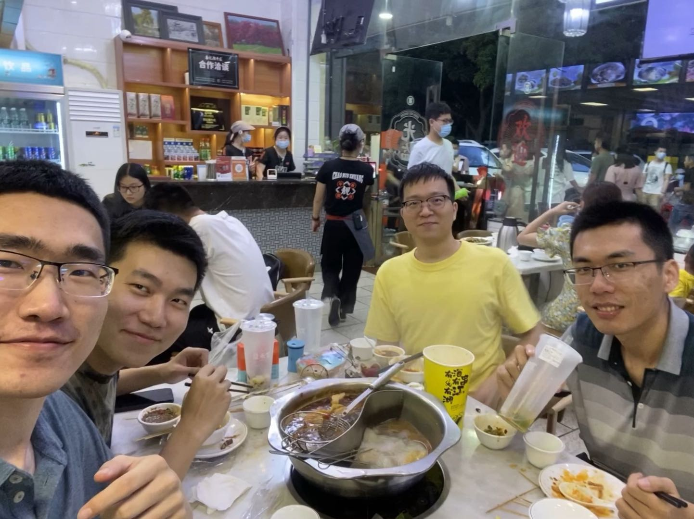
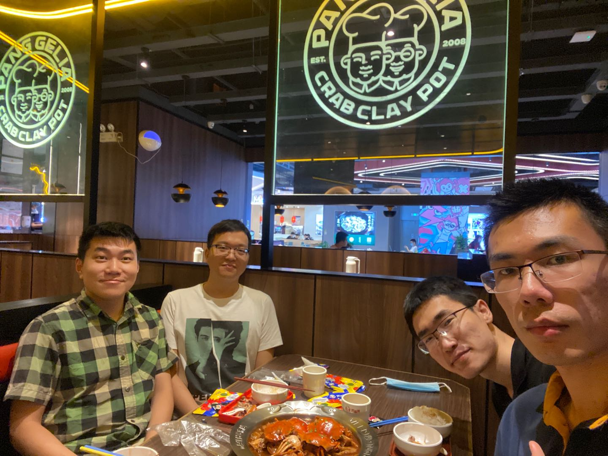
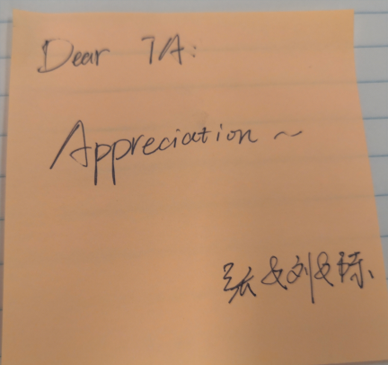

## Going out
2020/5/22

It is hard to go out of the campus in recent days. I have to find some obscure way along
the Dasha River. Still, the field workers stop me when I come back. They warn that I
can't do such thing any more.

## Reunion
2020/5/26

Reunion with partial members of 2018 summer volunteer teaching students
since Shaoping is going to leave the campus tomorrow.

## Eating with lab members
2020/6/25

## Climbing
2020/7/15

This is the second time I went to TangLang Mountain with my roommate, Pengyang Zhao.
Usually I went climbing once a time every weak.

## Poem
2020/7/16

When I went to iPark this morning, a poem flowed to my mind:

曾幻年来事非空
笔底飞鸿已无踪
春风杨柳花开日
粉面桃花人不同

## Eating with lab members
2020/7/22

## Split of Life and Study
2020/8/3

This night I said to my roommate PengYang Zhao,
"In most time I studied in lab and
take rest in our dormitory."
"No, you should say, 'I take rest in the upper and
study in the lower.'" Peng replied.

Some background information: our bed is on the upper part of
the furniture in the dormitory.

## Delivery
2020/8/4

This noon when I was in the elevator of C2 Building, iPark.
I heard,
" 美女你到十四楼吗，能帮忙把这个（外卖）放前台吗，谢谢，我打电话给他。"

## Thanks
2020/11/11

## Missing
2020/11/16

信息大楼保安的问好，
荷一食堂的支付成功，
宿舍楼前门禁的谢谢，
都不如听到你
让我如沐春风

男生节的横幅，
电脑里的程序，
各式的菜肴，
都不如看见你
让我心驰神往

学外语的新奇
做科研的奥妙
读诗歌的典雅
都不如想到你
让我全神贯注

## Teaching others
2020/11/17

Teaching others will not always improve yourself. I am again touched by such view when preparing a tutorial on the principle of neural network. This slide is intended for a meetup of a regional data science group.
I think the problem with routine lies at the
stale impression of knowledge.
When I am quite familiar with something, I will get tired.

## a poem in dream
2020/11/18

浚江东上阻 河化入清流

欲留人之意 不复旧时书

## a poem after wake in the morning
2020/11/19

春时去已尽 秋日水流长

还将旧时意 怜取眼前人
