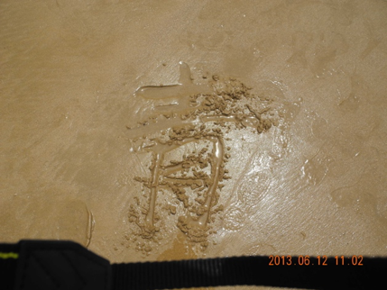

# 青春万岁
2013/6/16

## ——记青岛之旅，by 如风

主角：丁宁，老边，如风，小吴

天色微明，白发垂髫早已在车位上坐定，宁带着昨日超市的战利品缓缓向我们挤来。

本地导游：出门在外，安全第一，特别是钱包，放在前面才是包，放在身后就是别人的包了。待会儿我们发放帽子，咱们人多相貌各异，为防止走丢了，游览时我们以“帽”取人。

某小孩哭闹，大人：再没礼貌立即让你下车。

车上游戏，老边双手摊开，并拢，稍摇头，摩挲着笔直向上的“丛林”，又仿佛故意扔掉什么似的，双手翻转180°向下运动，而后又从空气中用双手掬起什么似的，最后两根食指靠拢，各完成半个圆周运动，在直径的另一端会合。

我们在做动作猜成语，可我如堕五里雾中，即使大宁表演的惟妙惟肖我还是一脸茫然，

宁：我再演一下引申义。

宁先拉一下小吴，后猛地甩开，终又hand in hand.

……

边：够形象了吧，破镜重圆而已。

青导中途上车：青岛胶州湾大桥是世界最长的跨海大桥之一，耗资百亿，极大地缩短了……

风：海里的是渔船吗，怎么那么落伍？

宁：渔民很穷，好船买不起，不过它们是观赏性船只对我们夹桥欢迎也说不定哟！

风：说到渔船，前阵子台湾渔船被射杀一事大陆为什么大张旗鼓地报道？

宁：国际关系一言难尽啊，两岸关系在报道上必须休戚相关，中菲关系也是摩擦不断，中方能不借射杀事件表现对台湾同胞的同情吗，能错过再凸显菲方无理取闹、骚扰邻国的恶劣行径吗？本来到边境打渔就没什么了不起的，抓渔民纯粹是一国向另一国示威的借口，若不是两国关系本就不好，打渔这种小事也就当没看见算了……

团饭满桌，众人食欲不振。

宁：你说这些几乎没动的素菜将归向何处，也不让带走？

边：很可能又是一盘新菜。

宁：我们该不会也在吃暗处理后的东西吧？

边：别乱联想了，他们都上车了。（随即起身）

宁：可我还没装完我亲爱的玉米呢。

……

饭店外，宁：你吃饱了吗？

边：还用说？此外，我在减肥，昨天还去健身房了呢。

宁：我坚信人不能没有肉……

确实，人不能没有肉，如狼的男孩更不能没有肉，此句和梁衡的“人不能没有爱，如花的女人更不能没有爱”颇有相似之处呢。

某小孩：我想回家。

大人：怎么能回家，我们还要在这住一夜呢。

小孩：可我不在家睡不着。

大人：别乱说。（厉声）不好好玩以后就不带你出来了。

好吧，今年端午一定回家。

上了游船，船长的叫卖声不绝于耳，“有想当船长的吗，5块钱一张。”

N久后，“你想当船长吗，小朋友？不要钱的。”此小朋友迅速跑开了。

风：小吴，把你的望远镜借我看看。

吴：什么望远镜？

风：这个粉色的镜筒？

吴：雨伞的外套啊！

海子说面朝大海，不过我们很多时候面朝镜头：

上岸后，宁：小吴，你手机响了。

吴：妈，我刚从海里回来……

栈桥之行，我们在马路左边与一堆堆游客相向而行。路窄人多，宁、吴并排在前，风、边在后，保镖、human dealers 都不像，高中学生气未脱，何况人人一副glasses，怎么看都是未被社会染缸泡过的adolescents。哪像前面同车的两位，明明比我们小一级，打扮得像成熟的couple。

实践是认识的来源，如风对如影随形的认识随着紧随宁、吴的迤逦前行而加深。在众人对千篇一律的游客颇为厌倦时，大宁兴奋地指着礁石：“我们下去看看吧，哪儿怎么有这么多人趴着？”

小雨、海浪和礁石作背景，烘托出捞某绿色植物的人们，

宁：“这大概能吃，不如我们也捞点回去吧？”

边：“拜托，你难道要用水杯装吗？”

徜徉片刻，宁：“这边背景不错，丰哥快用你的大相机照张相吧？”

众人琢磨半天，可高深的相机仍有损入相者的形象，

吴：“这张太亮了。”

老边作深思状在礁石上端坐半天，可由于模式错误，他的英姿与海浪同消……

回到马左，以原队形继续前行，

宁：老外！两个老外！

边：你要做什么？

宁：他们好像有交际困难，丰哥你过去帮帮他们吧，顺便检验一下听力成果。（推人）

风：我很害怕。

边：“到时间了，我们回去吧！”

吴：“可是——”

宁：“别不好意思，我替你说了吧，不就是想上厕所吗。”

吴：（stamping heavily on the ground with high-heeled shoes ）“不是的啦。”

风：“这没什么，因为我也有这个意思。根据路标，厕所就在前边。”

边：“我们得快点，就剩5min了。”

宁：“急什么，那两位早就流连忘返了，哪像我们被训练的时间感强烈，还1min收卷我都不急，你急什么？”

……

宁：粘玉米！

边：一路上你一直没停止进食，还没吃饱啊？

宁：都是你中午没让我吃玉米，现在我可得补回来。

 

在参观栈桥的去路上，宁的目光随路边的shells而流转，在归程时，在卖主的大力宣传下，两位小女不仅留步还留了charge。

海底世界，如风：我们来看人还是照鱼？

宁：一会儿看美人鱼。

边：还看鱼美人呢。

海拔差些的宁、吴虽未观到人鱼表演，但在鱼饰、鱼食的商品天地中乐而忘时，直到

吴：导游来电话了。

于是后面的精彩只好等下趟分解，导游啊导游，倒霉的游览。

宁的表现欲在海兽馆达到了小高潮，当了一回北极人：

 

旅馆大厅：一张地图摊开在玻璃桌上，经研究发现，我们还是不知道自己在哪儿。

于是左转右转，前看后看，我们被旅游经验丰富的大宁带到了旅馆对面的烧烤店。

宁：老边，用过晚膳一起去家乐福吧？

边：我受够陪女生逛超市了，而且我的腿快走断了。

宁：难道你放心让两个柔弱的女子……

边：还有他。

宁：一有危险，他逃得比谁都快。只有你，你那强健的身材，发达的肌肉，才让我们有安全感。

边：我服了，女人真是可怕的动物。

过马路时，大宁紧攥老边的上衣，小吴紧牵着大宁，一只cock 带着两位 chicken，闪过了没有红绿灯的十字路口。

归程，前面有家冬虫夏草的商店，风：什么是冬虫夏草？

宁：这种问题还不得把你的女朋友吓跑？

边：大概是冬天的虫夏天的草。

吴：不是啦，这是一种寄生虫的尸体，吓死人的。

五月的风作背景，拍照的高潮来临，远处有： 

近处有：

海水浴场上，宁多次试图埋葬老边的鞋，

宁：这次要做得不留痕迹。

风：我们每个人在沙滩上写一个字吧，组成青春万岁。

宁：好，我写“万”字。

边用单脚完成“岁”，我用食指写了“青”，小吴用“三爪”完成“春”：

  

  

海水会蚀去它们，（边：我要找鞋！）但海水带不走：

小青岛，抓小蟹，宁：那里！那里有一只！

边：我早看见了。

宁：不行，这只是我看见的，你抓住得送我。怎么样，老边，老鳖，边鳖……

