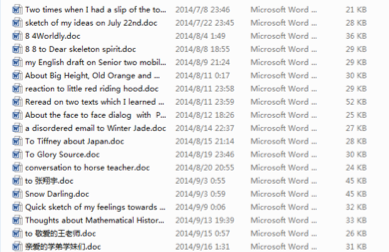

# 个人文学史兼个人德语文读史回顾
2015/11/3

我就当写电子日记一样回复你的读书感悟吧。

Faust 这本原著没有读过，我只知道它作为Deutsche Kultur应该会被第二外语课程所涉及到，但这种涉及或许只是简单提一下名字，至少在外研社的Klick auf Deustch系列教材是如此。我想你的感受至少有一部分是基于外语的，如果看不上在外语语法上的纠结，就说它是appreciate of another culture 好了，这也是第二外语教学的一大侧重点，也许在乎这一点的人，不用老师反复灌输就能领会，但对不以为意的人，可能最多只是外语语法课的一种点缀和装饰。
对于我自己呢，很遗憾地告诉你，差不多完全属于后一种学习者，至少目前演变的结果是这样。本想找一下今岁寒假前后的“准电子日记”看一下当时的想法，但很不幸，那段时间几乎是空白---前后的阶段平均每周都有记录，但在2014，11，20—2015，2，7则没有一篇。准确的说寒假里确实有二篇，读过后我才想起当时自己原来还去过National Museum 去看了古史陈列，但两篇的主要内容却是在讨论意识形态问题，可能属于政治哲学的范畴，当然非领导人讨论这种问题只是在胡说八道，不足为信；而关于其他方面的记录则为零。这和去年的寒假形成了巨大的反差，主题比较多样，如下：

到了去岁暑假，则着手中译英了几篇QQ空间的日志，写了一些读书感悟之类，内容也比较杂乱：
 

原则上这种回顾应该从有记录的起点开始做，但因为之前写过relook，基本上是几个月前我关于“个人史学”的胡乱建构，里面内容重复性挺高的，。这里copy过来就好了:

纸制之文本，余有若干存于家中，狂人日记者为多，然其中夹以与年相若者纸条书信往来数十，叙事往往因校园之事而起，几以考试为核心，如常记某日晚自习之安排与做题之进度，最常用之方法为同类比较，即举他人之高效刺己之不及，间以所谓个人文学创作与评论—此种材料之出现本以初二与高二入文学社为诱因，然确因此二年之文学活动，有两本个体文创集存焉；而文学评论则极晚出，仅为高二暑假文学社之云散之余波，然所留之数篇稼轩词之原创评论，今日觉其确为极珍贵之个人史之文献。盖余自存之纸制文献，为中学应试所发者十居七八---正如吾国古传之史料作家谱者为主导也。今日视之，此类文献多一分不能增其值，弃之又有所不忍为。然终不能弃也，何则？以其为唯一保存个人史料之材料也。试举一例以明之，余高一下时，班有一女畏难而欲自行辍学之事，于此事之前后者，余于日记中有所及之。然均置之于考试思维下关照此事也。因今日余之思维大变，当日之叙事逻辑，不有一手材料不足以明之。然要之余绝非叙此女之所为也，是叙余之反应也。当时班内因此事有开涉学习态度与资质之班会者，余所以于历往无数之班会于此会犹有印象者，实赖当事之日所记之只言片语也。后与他人邮件往来于此事虽多有涉及，然其所赖者，记忆乎？纸制之文本乎？后入文学社为文时，余尝尽翻出事关此女之当时之记录欲以成所谓青春记实者，往往叹资料之阙，且所关于此女者多关于余之学习观，实不过余借他山之崩亦或他山之玉，所谓记录之主体者，不过以助应试之学问耳。

因以考试哲学形诸纸张之文字实繁，故文学之文之可贵处可显。然此处言其可贵，非指余接此二年之文学余绪而又有何发展矣，不过以其当时力所可及之优美之文学语言间接保存个人史料耳。其中犹卓者，为数篇所谓“青春纪实”之文，此本余当时于此类中短篇小说有所好，故不自觉用其手法写真实之人物与故事耳。然纵观此数篇，均以第三人称写女生，真不知古之所谓宫体诗词者，与余当时之想法有重出否。代人立言，然所立之言，古之写爱情，余之写其追梦故事，然诗人真可解闺妇之思哉？余之真可知所叙之人梦之所之哉？不先行访谈之实而以己之私意填补信息空缺，此或文学之所以为文学哉！

至于文论者，其所以发而为文者，必有其源。或以助所谓语文考题之“诗歌鉴赏”门，此虽见笑于大方之家，然当时余之所为之拓展者，盖莫不夹以此种之私意，余于开篇有机一门学习动机有所涉。然此步既出，其历程与期效者，又绝非八分之“诗歌鉴赏”所可限。盖于稼秆词有所涉、则于其所援引之东晋典故不得不有所措意，至于体会所谓“时代之主战精神”者，亦自然之果。然所读清照词与花间词则沦为助余修饰个人文学语言之装饰矣，至于清照，稼秆之人格，成余议论文万能例证者，以今日之眼光视之，诚无足轻重。此处似又回到所谓考试哲学者，然吾恐一部《西厢记》中，亦难脱劝男儿读书之旨在，所谓“青霄有路终须至，白首无名誓不归”之考试哲学也。

于记账式之赤祼祼之学习日记至所谓追梦记实，再至拙笔出文论，其间文体之变化，诚一种进化哉。此种变化，唯纸制之文本可显之，于其中涂沫删划处观其措意，于积累之厚重观其演化，是为要也。2015 6 12取自《论个人史学》
上面的谈论虽夹杂了很多他种类比，但关于“大众文学”一线还是有所交待的。
过了一段时间又有所补充，还是往前追溯的，所以材料更鲜了，但总体意思没变：

于是进而考诸所谓空间日志者，亦于初中最为加详，内容与当时纸制文字所存多有互见，然亦有少数为独有者，一则曰言初中数学之体会与班级数学学习状况，且二者之先后出，几为师之教学法所规定。因八年级有良师遂写数学之实，而来年失望于他师之因偱而作数学之虚也。虽然，以今日之观点视之，则前者为化石后者仍有鉴于当世焉。其故者何？因其以课代表之视角言教育也，必有一般之原理规律潜行于其中矣，使有志于教学之数师而读之，则必有所启而可有所施之于现实也。若推而广之，则凡班级写实之文字，皆可作班级管理之史料读之也，设使吾乡世变无巨，则此虽曰史料，亦必有资于“治道”也，如余于排位风波、高中班会之记录。所独有之史料之他端入短篇小说部，即汶川一周年祭时作之，即写师生之情谊也，盖其时所谓北川中学之殇，或以同类相感，于余有较大之影响，又于其中牺牲之某人民教师之事迹，有深刻之印象，而所以终成此篇者，特辅以当时之月刊《儿童文学》作各类文学体裁以追悼之。此文虽于当时之情境所特出，然终不过为余入文学社之大背影之一笔。且以今日之观点视之，于道德情感虽出于真挚，终难脱为媒体与《儿文》煸动之嫌，且所谓“灾难文学”者，其果有哀先人，勉后人之效乎？自许科技不敌天灾猛，而人间自有真情在，，于图书馆报告文学之目察之，此类为汶川注脚之书充栋。然多极以文学渲染之能事于历史之真相有失，其说或可商榷。其余所谓日志者，往往与当时情境下之特定思潮相联，与同龄之日志多有互见，于今价值甚小矣，如怀友诸文。

2015 7 17 取自《大学生视角之个人史学》

终结这方面谈论的准日记，是取自关于儿童文学的谈论（见附件），这又是往前了，再往前是不可能了，于是这方面谈论就结束了，在谈儿文时，也有提到这种结束。

所以之后在你crazy 的方面我没有新的想法，只好综合一下旧时的文字，作为一种回复。

但旧时文字没有的，比如今岁寒暑假读而未写的部分，借着这个机会填补，但无论如何这种填补已经质变，所发观点出自当前我的认识，而不是彼时。
对于我来说，一个文字空白期接续着一个文字密集期构成一个阶段，每个阶段的文字差异巨大，之所以没有引前几周的文字即在于这种差异已经使得三篇中的每篇读后感文字掺杂太多的科学形而上论，根本不是在讨论作品本身，虽然看下面的题目和之前没什么区别：

具体写了什么，估计只有我自己才知道。不过这一阶段持续的时间比较短，现在的想法又和写三篇读后感时很不一样，同样的巨大转变也发生在今岁寒假，所以那之后的文字就成了上面引用的样子，而在这段文字间期之前，其实没有太多的变化。

没有记录下关于今岁寒假所读的 Wuthering Height 或许有一点可惜，而现在唯一能说的只是读此书和英语阅读能力训练之间的关系，当时尝试着几乎不用词典地顺大意，差不多可以知其要，当时还试着去找德语版，虽然在Google book上有电子书，但由于权限等原因而让人很恼火，当然类似的searching傻事---二外完全达不到对照的程度，在我和生命历程中一直没有中止，过去简单地归于商业化，现在的观点则大不相同。

也许这种technical 的事情放在任何时候回忆都不会有太大变化，但能反思一下的场合可能并不多，而反思所带来的新的Inquiry,由于和你发起的Humanity相关话题实在太远，这里也不便叙述。

今岁暑假把 Die Leiden des jungen Werther拿出来看了几页，其实困难度并没有太多变化，读不下去。后来想找儿文，Das fliegendeKlassenzimmer,但只有中译版。于是读了点东德的小学国语课文。几周前通过馆际互借系统去了北京大学图书馆，在中图法H区找了本外语学习导向的德国古史看了几页，在前人密集的铅笔汉注下差不多可以顺下来。

之前就知道读原著去I区各国文学分栏即可，但里面充满着文学研究用到的reference books, 可能除了Marchen der Bruder Grimm 不那么高深外。之前选修一些历史系的课程对人文方面的research的范式和工作量有一点点体会，由于对文本的依赖度很高，一方面原文的精读没有一个止境，另一方面其他阐发原文的文献要读的实在太多---总是不可以无根据的发表个人的人文见解，即使觉得自己深得梁任公“真传”，但让别人一听说此人不过读过梁任公的只言片语就敢胡说八道,如声称自己的阐释有任何学术价值。但要是自娱自乐则无可厚非了吧，仔细想一想，即使我身边一些貌似懂很多领域的“泛专家”，其实也并没有那么历害（当然这是我的臆测），所精通者，一二学问而已，其余的假学问要么是胡乱翻书习得，要么是由真学问类比想像出的样子。所以我上面整篇所写，大多数也是没有多少根据地胡乱搭建所谓的个人文学演化路径，放到公开场合就贻笑大方了。
