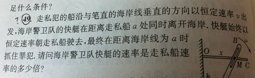

# summary of graphics programming learning

Hello, Liu. Recently I am engaging on graphics programming with C++。

It struck me that the principles therewith are almost at related mathematics, physics and data structure.

As for mathematics, matrix transformation in three dimensions constitutes the foundation of methods of rendering graphics(处理图形).However, at this point, one data structure called "Stack"(栈) is used and it is naturally hard for me to understand in full scale because of my ignorance about "data structure"(数据结构)。

However, even without ability to use complex data structure, using what I have learned before about programming help me greatly to go through several chapters in this amazing topic. From static graphics generation to very simple animation effect, it is indeed a nontrival progress. But the focus of this email lies on (Kinematics and Basic Newtonian Dynamic).
For general animation purpose, physics principle is not needed to design the animation effect. But in some domain(such as 3D or 2.5D games), it can not output arbitrary results, contrary to human instinct (for example, game characters normally walk on the ground due to gravity--this sentence is from A Serious Textbook called "Artificial Intelligence For Games). To make animation effect consistent with physics reality is the task of the aforementioned book with more pages than your “Analytic Mechanics”. Hence I wonder, which kinds of part of discipline called theoretical physics is needed in the process of approximating the reality in the domain of AI (or narrowly, AI for games, GAI). At least, displacement, velocity, motion of rigid body(translation plus rotation) are mentioned, while conforming the movement of  game characters to Newton’s second Law is still a novel idea not so widely used. Such embarrassing phase (motion of past game characters even violate the fundamental principle of dynamics, they simply start abruptly, move with uniform speed and stop instantaneously) has its technical roots and computer scientists can use other more efficient methods to “cheat” perception of human (but such “cheating” has both its biological and physical basis, like human eyes can not distinguish XX pictures per second.) Even with such embarrassing situation, there is still a newly appearing discipline (Game Physics, maybe under GAI) trying to combine the two (PS, there is even one College Level Mathematics Textbook in our library with game insight, that is, it formulates mathematical principles and illustrates them with game-related examples, suitable to motivate general college students to learn 高数 well Such Treatment can parallel College Mathematics Textbook for biologist.

Whatever to say, GAI is rooted in the area of Entertainment and has nothing to do with scientific research. Our concern is about how to do computer aided academic learning and (in the future) domain-limited research (if without accident). So both algorithm analysis and programming techniques are not so important as to how to get our desired results. At my present level, I think two abilities are basic for general scientific workers---Use related software to do related calculation and draw proper graphs. To go farther is learning how to animate the system evolution. But owning such ability needs quite a lot effort—we start from special-purpose software (like Mathematica), which are different from general-purpose software(like C++ Complier) because what we learn can not directly be used to solve problems outside the special region. You can not copy Mathematica Code to C++ Complier and run on successfully, and even the reverse process needs such adjustment to guarantee the rightness of grammar. So such technique is never suitable to share details with outsiders. Only to show others the result （both computation and drawing）is enough. In the future, we probability have to learn to use other special-purpose tools (such as LaTex for setting types for our thesis (排版)).

As for Mathematica, my conclusion is that I learn it mainly by self instruction.

Mathematics students have only 5 classes to attend and the professor can cover the core language part. Coursework is targeted at integer number manipulation from www.projecteuler.net. Because of my unfamiliarity with this software at first, I just start graphics programming with C++ ten days ago. The marked problem within the picture above is all about “Pursuit Curve”, in Chinese, we call追线. I happenly find that GAI uses this as a basic method to generate the route the enemy takes to approach the protagonist. I am inspired by the pseudo-code in the aforementioned GAI Textbook and write a C++ code to generate one simple case about pursuit curve, also described in the problem. I attach this execution program in the appendix. Parameters are: Initial Condition (pursuer v=15, pursued v=10, their distance=200) and the speed of the two characters are constant.

omitting the source code is because of special functions used in it, which are not in the original C++ library, therefore it can not be normally complied in other environment.

Hope for your simple solution to this problem within the picture. The picture is from one tutorial book for Physics Competition of High School Students.

yours

