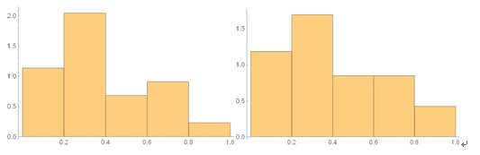
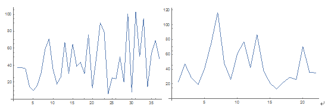

# 关于中文字长的统计分析和语言学解读

做了一个不成熟的关于个人中文句长的统计调查，和你share一下。

使用Word的字数统计功能，逐句获取句长，实践发现此功能误把中文输入法的标点也计算在内了，所以每个数据点都有一定的误差。我统计了

一 2015年1月期末备考期间写给冬瑜的信
二 出自专业是牢笼吗..写于2013年暑假

两篇文字记录，都曾寄给过你。

一中大概有900多字，按照某一种划分句子的标准有22句，最长的句子大概有117个汉字。

二中大概有1600多字，按照同样的划分句子的标准有37句，最长的句子大概有103个汉字。

先将一和二中的数据分别除以最大字长作为归一化，再按照中学统计的知识，作出频数分布直方图如下：

左边对应一，右边统计的是一和二的数据全体。

由图中可发现，最频繁的分布段是落在0.2~0.4，按照归一化因子约为100左右，大概推算出20~40个汉字为上面两篇文字记录所用的句子的最概然长度，分别计算各组样本的平均值发现其均在0.4左右，即40个汉字为上面两篇文字记录的平均长度。进一步的，借用大学的概率论与数理统计的知识[没学过可略过此段]，我想用已知的分布函数去拟合上述概率密度曲线，于是需要确定所选定的统计模型和相关的参数。正态统计模型虽然最常用，但在这个问题中，考虑到字长关于均值的不对称性，不适合。我尝试选用其他的统计模型并用合适的估计方法确定模型所需的参数。考虑到字长有限这一截断性质，似乎只有Beta分布比较合适，但我用矩估计的方法并没有给出很好的拟合参数，可能一方面是数据本身太少且有一定误差，另一方面是矩估计本身有一些缺陷。下一步（如果有时间的话）可以考虑其他估计参数的方法，如Bayes方法。
另外，还可以以行文顺序为横轴，句长为纵轴作出句长变化图如下：

左边对应二，右边对应一。由图可见，在行文的始末，字长都没有达到峰值，这也符合一般的行文习惯。由于我没学过统计中关于这方面的理论内容（如Times Series）所以无法在这里科学地解释图形在中间过程的变化与走势。

最后，我在用Word统计句长时，无意中注意到了最长的句子的语义(sematic)和句法（syntax）似乎有一些规律可循。以一中117字的句子为例：

有時會想起你在我入學前說過的很多介紹，從人人飛信微信到各類網站，核心都落在互聯網上，事實上面對選擇，如此龐雜的選擇，與我不善溝通的性格，交織成的，是一個擁有四樣高科，按時完成作業，幾乎從不娛樂，做事惰性較大，難以自我提高的普通的學生。

上面是原文，出于保留历史痕迹的考虑，应尽量在各方面都不做改动。句法上最明显的地方是这个长句由多组短句复合，用了很多逗号。这句话在语义上和其他句也有较明显的区别，它的上下文都在讲最近发生了什么，但这句话却是用简短的语句剖析自我，运用中学语文的知识也可以看出前半句只是铺垫，后半句的转折才说出了想表达的内容，这在我们的语言表达习惯中似乎很常见，但这种表达法很容易让句长增加不少，尽管前半句并没有实质的语义内涵。

接着来看文字记录二中的三个长句，其中2句（句长分别为97和101）如下：

我在这里只能简单地提及我和她几次很特殊的碰面地方了，文昌花园，银座门口，车站和二胡老师的住所，每一次碰面，好像都有特殊的原因，而发生的事，如风觉得情景还是如昨日般清晰，这些用纯写实的笔法记录或许没什么。

第二个女生丁宁，在高考出成绩前有3次来往，除了那次去参加英语口试外，另两次都是广场上的会面，话题却比较单一，6月9日晚回忆老师的种种对待，自己虽和她在很多方面的观念和行事完全相反，但一直很敬慕她

也许在碰到这类话题时由于种种很难说清的原因会让句子变长，但这一点需要进一步的旁证，或许只是我个人的习惯。同样的，长句的句法特征很明显，由多个短句复合而成。

文字记录二中另一处长句（103）为：

如风很长一段时间是倾向不读小说的，认为只是虚构非现实的东西，现在想想，缺少了想像的能力，也是现实的自己的可悲之处，说大白话，确实很真实，但对于他人而言自然少有感觉，而且未经加工的生活只能以粗粝的面目展视杂乱。

我在表达个人观点时，在这句话上，结构还是很清晰的，先列态度再解释。但这句话的复杂性在于语义上的模糊，因为说到最后我似乎对这个问题比较纠结，至于“不读小说”也只是倾向，所以句长的增加在这种欲说欲不清的观点表达的case上也是比较自然的事情了。人都模棱两可的问题上，计算机估计也无法分析这种长句。

综上几处浅显的语言学视角对长句的讨论，有如下的结论：

以下几种情况会使句子明显变长：

	剖析自我

	表达爱慕之情

	表达模棱两可的观点

以上就是我关于个人中文句长的统计调查的全部内容，在很多方面有一些初步的想法，但来不及做，就草率地写了下来，真是惭愧。而考虑到现在也是我的理论考试周的事实，做这种empirical的东西也算run off topic的不务正业了。

