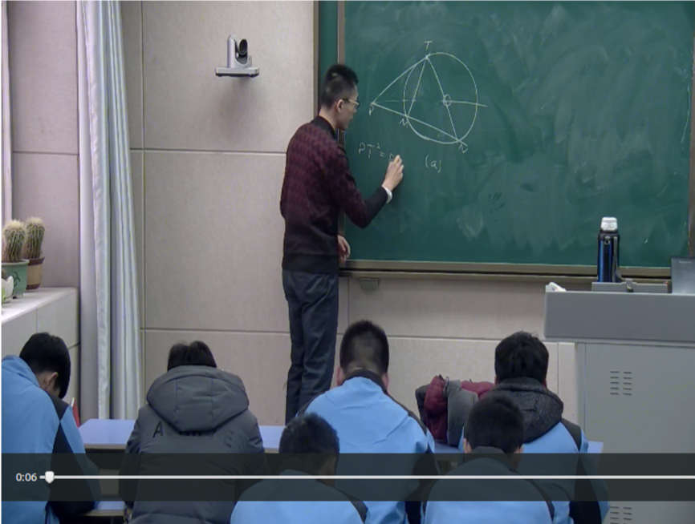

# 平面几何讲座实施纲要
2018/2/24

作者：赵丰

讲座名称：平面几何拓展与提高讲座

讲座目标：本讲座直接针对全国高中数学联赛平面几何部分，旨在帮助讲座参与者准备联赛平面几何部分。但在间接上对讲座参与者准备高校自主招生考试也有一定的裨益。此外，讲座实施者还认为，此次讲座作为初中平面几何的延伸可以帮助参加的同学认识平面几何的基本规律，初步了解平面几何的研究方法并培养对平面几何部分的兴趣。

讲座内容：角平分线定理，弦切角的性质，四点共圆的判定及性质，圆幂定理，托勒密定理，根轴，面积方法和塞瓦定理，高中数学联赛2012到2017年的平面几何试题（共7道，自己看完答案）。

讲座进度：分3次课，按照上面列出的顺序讲授。

讲座时间：2018年2月19日、21日、23日下午3点到5点。

知识基础：初中平面几何方面，讲座参与者应具备
（1）掌握北师大版初中数学七年级上册到九年级下册和平面几何相关的章节；（2）全等三角形和相似三角形和圆的基本性质可以灵活运用；（3）尺规作图的基本能力

讲座作业说明：本讲座每次课后均会布置作业，需要讲座参与者完成，其中第一次需要在下一次课前前一天下午3点前交上，后两次作业通过拍照发家长（微信）群的方式提交。作业内容绝大部分是课上讲过的题型，旨在帮助同学巩固所学内容。每次作业均会登记完成情况，其中前两次作业批改后再返还给同学，最后一次作业会发批改情况说明到家长群。

讲座实施者简介：讲座实施者为枣庄市第一中学2013级毕业的校友，现于清华大学深圳研究生院攻读电子工程系的博士学位，从事"数据学习"方面的研究工作。对平面几何部分有一定的了解。

讲座实施者联系方式：邮箱为616545598\@qq.com

马老师简介：马丽老师为枣庄市第一中学语文方面的骨干教师，在语文教学和班主任方面积累了丰富的经验，所指导的学生很多考上名牌大学，这次讲座即为马老师负责组织。

纲要版本：v3, 请以最新版为准。

关于教室：枣庄一中录播室。

