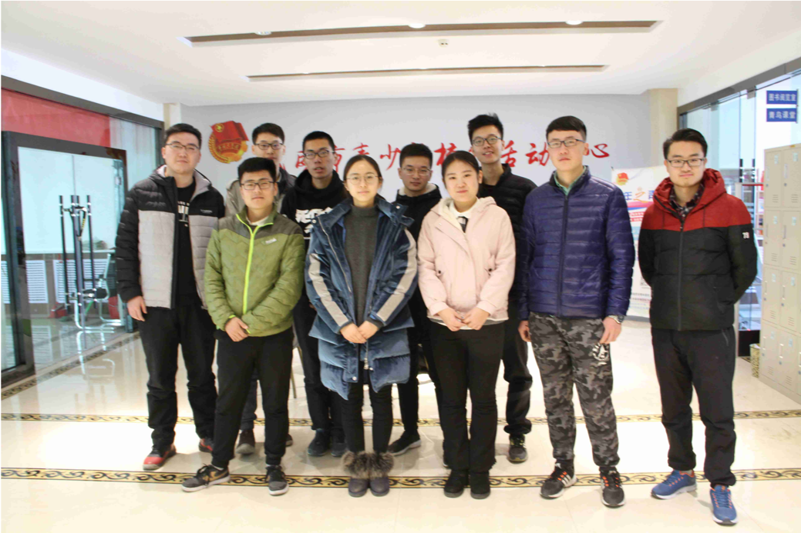
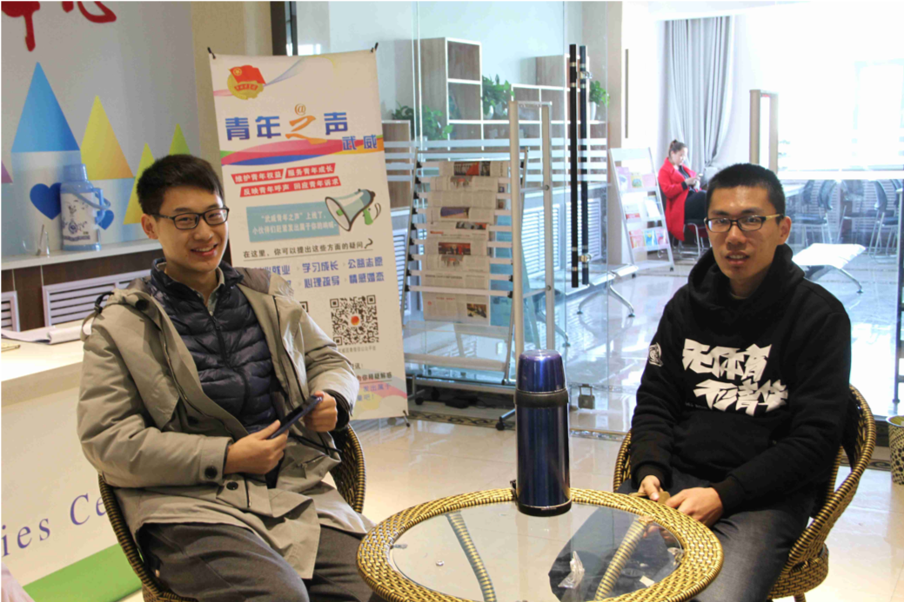
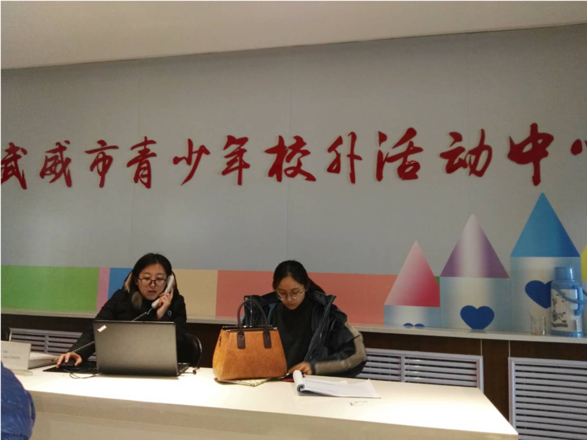
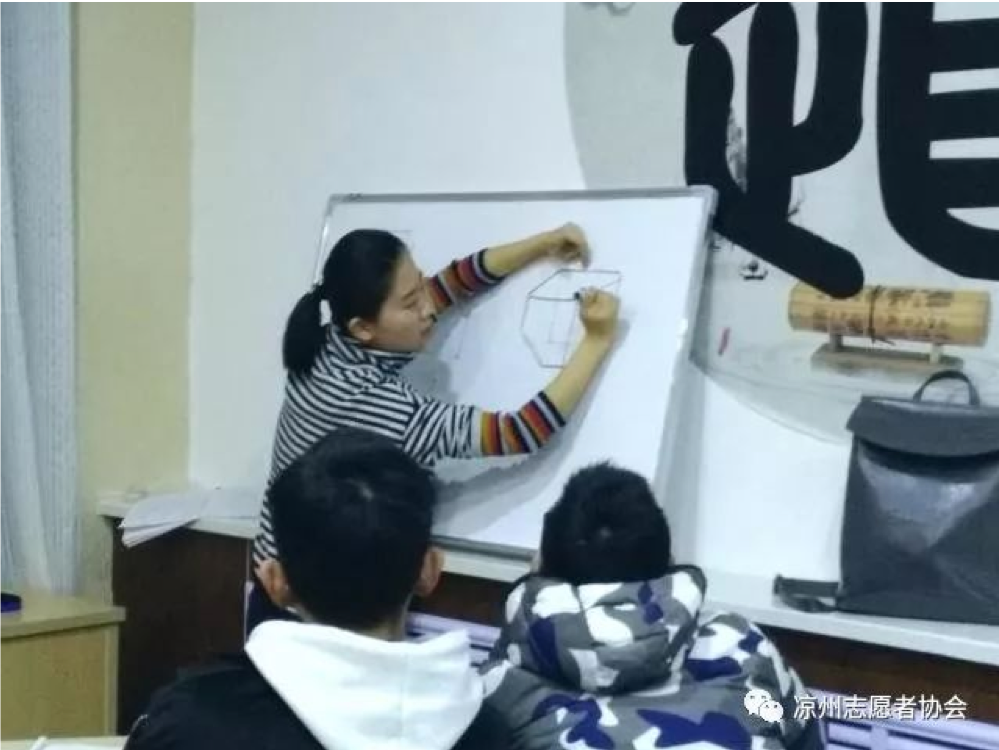
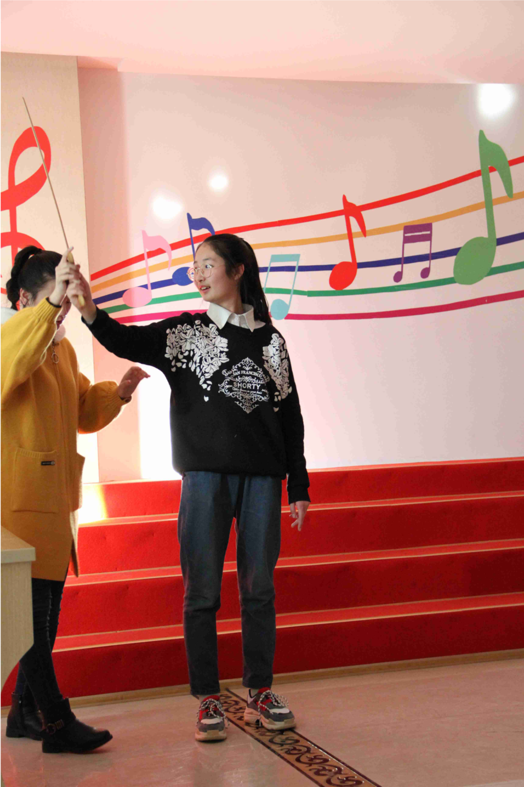

# 凉州区志愿者协会筑梦者义教服务队交流
2018/2/4

2月4号上午，清华大学深圳研究生院甘肃武威实践支队支队成员赵丰前往凉州区武威市青少年校外活动中心，与凉州区志愿者协会筑梦者义教服务队相关负责人进行了相关的交流。

下图是赵丰与今天上午参与支教的部分志愿者和相关负责人合影：

毕业于武威市第一中学的王德坤同学，现在读哈工大机械大类专业大二，在去年暑假怀着服务家乡教育事业的热忱联络了凉州区返乡的同学，成立了义教服务队。义教服务队得到了凉州市共青团委、志愿者协会等机构的支持，今年寒假青少年校外活动中心将大部分的活动场地提供给义教服务队开展支教活动。

下图是赵丰和王德坤交流的场景：

下图是青少年活动中心周末相关老师工作的场景：

今年寒假义教服务队主要面向六年级到高二年级的同学，通过凉州志愿者协会的微信公众号平台以及线下宣传等渠道，分别招募大一、大二的大学生志愿者和当地在读的中小学生。今年寒假除了文化课外，还开展了音乐、舞蹈、模拟联合国大会的兴趣课。

下图分别是文化课辅导和兴趣课辅导时的照片：

服务队的志愿模式在外地也得到了传播，山东新泰市的李方舟同学是王德坤的同班同学，他今年寒假返乡后也仿照服务队的模式在新泰市区发起了以“筑梦者”为名称的支教活动，目前该活动还在宣传招生阶段。

服务队吸引了一大批关心家乡教育事业的当地大一、大二同学，他们在一起策划支教活动、管理志愿者和参加活动的中小学生。目前志愿者管理主要采用团委的志愿汇App 作为志愿者签到和时长记录的方式。

今年寒假服务队会在2月10号 晚上 7 点 武威商务大酒店宴会厅举行以“欢乐今宵，筑梦未来”为主题的晚会，届时会邀请武威市当地的媒体和团委的领导参加晚会。

未来服务队打算联络武威市周边的区县，逐步将服务队打造成一个区域性的、专业化的教育方面的志愿服务队，另外服务队目前的主要成员都是武威市第一中学毕业的学生，他们的相关负责人表示之后将会考虑帮忙联络当地的中小学，与外地的高校的志愿团队在寒暑假协作开展短期支教活动。

下图为凉州区志愿者协会的二维码，上面会有服务队相关的活动宣传：

