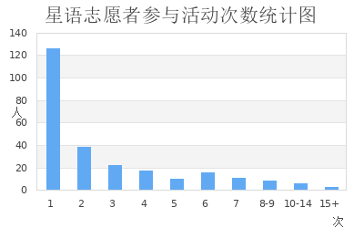

# 星语数据统计结果
2019/12/2

## 时间维度
* 2018年秋季学期共210人次，77人参加
* 2018年秋季学期共370人次（含拓展活动），129人参加
* 2019年秋季学期共189人次，72人参加

## 只有一个人参加的某次常规活动统计

|---时间------|---日期-----|
| 周五下午单周 | 2019-04-15 | 
| 周一下午    | 2019-05-06 |
| 周一下午    | 2019-05-27 |
| 周二下午金色年华  |  2019-10-21 |

## 条形图

## 折线图（2019年秋季学期）

