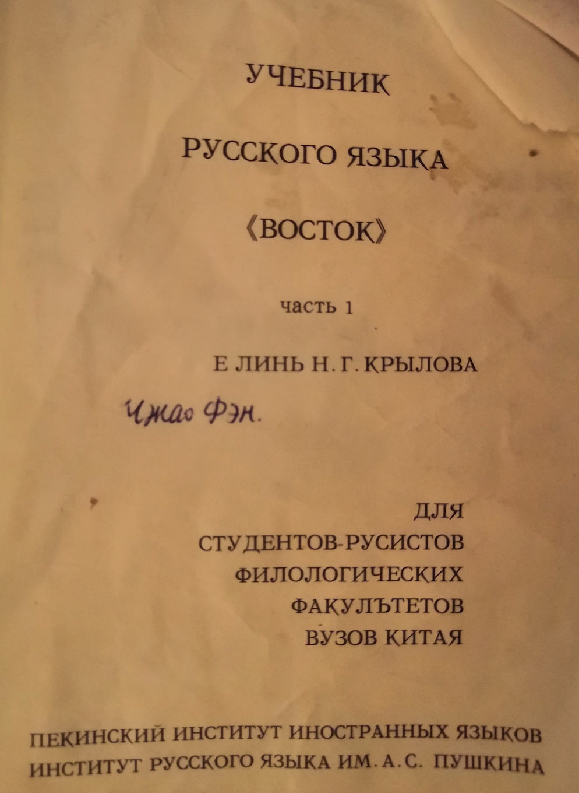

# Russian visit review
2020/2/14

# Preparing
报这个项目之前我修过学校开设的俄语一和二的课程，学校里没有俄语专业，这个课是面向全校本研学生的。由于研究生选课要老师同意，
我是大四上学期上的俄语一（何红梅），博一第一学期上的俄语二（张敏），两门课是不同老师教的，中间好像还有些衔接的问题。不过主要问题是，在我出国前，我已经接近2年没碰过俄语了。于是在出国前1个月把原来的课本找出来复习。好在那段时间科研不是很忙，每次复习要占用很多时间，有次被导师看见了，导师还说他上学的时候也学过一点之类的话。

学校用的课本（东方）是非常老的那种，一版竟然是上世纪末出的。尽管后来有十几次修订，但书里还是有很多小错误。

在圣彼得堡的这段时间里，有时候比较空闲，也会拿出课本来读一读。我怕吵到室友，就去走廊上的一个U型空间里读。这里的灯好像坏了，
我还得照着手电。

来参加这次冬令营的绝大部分是本科生，这也是意料之中的。当我在思考自己本科时为什么没有走出去时，我觉得很多事情会受到自身观念、家庭环境的影响，并没有特别后悔的地方。就像历史一样，所有的经验和教训都无法复制。

# Eating
圣彼得堡的物价不贵，一些快餐店比国内的还要便宜。当地的快餐店叫 шаверма，都是 24 小时不打烊。因为和宿舍、教学楼离的比较近、
这两周的早餐、晚餐我都过去吃，俄语菜单也能背下一半了。这也是为数不多的点餐交流起来语言障碍不多的场合。中午的时候经常去吃教学楼
附近的 McDonald's，这里的自助点餐机可以选择语言，取餐时叫号有大屏幕或者送餐到桌等，全程基本不需要语言交流。虽然对外国人比较友好，但感觉也少了些练习的机会。在吃够了美式快餐，同时感到市区 шаверма 价格并不便宜之后， 后来发现可以去 столовая 这种地方，点三件套：一个沙拉（凉），一个米饭加肉（热），一杯饮料。

# Language
刚来的时候看各种标语都是蒙的，呆了四星期后，标语关键的地方总算能看懂了，我想这也是不断重复的缘故吧。自己一个人呆的时候，每隔一天去一次国家图书馆老馆，第二天去新馆，每天都去一次最大的书店，让自己浸润在文字比较多且集中的环境里。一天到晚集中
在语言上我确实感到有点头大。后面因为有些国内的工作要做，分散开来感觉效果可能反倒要好一些。自己特定去电子产品商店买了俄语
键盘的贴纸弄到自己的笔记本上。常按的键上贴的字母都有点看不清了。

# Culture
冬令营期间有一些 cultural program，逛了一些博物馆；冬令营结束后住到了市区，一般也是跟同学一起去逛，我没有单独逛过。
因为很多文字解说看不懂，逛的也是一知半解。因为冬宫对于有学生证的同学免费，我一共去了3次。还有一次是自己逛冬宫周围的历史性建筑，只是在外面看那种，这一带很多建筑都有一两百年的历史了，不像国内动不动就搞拆迁。