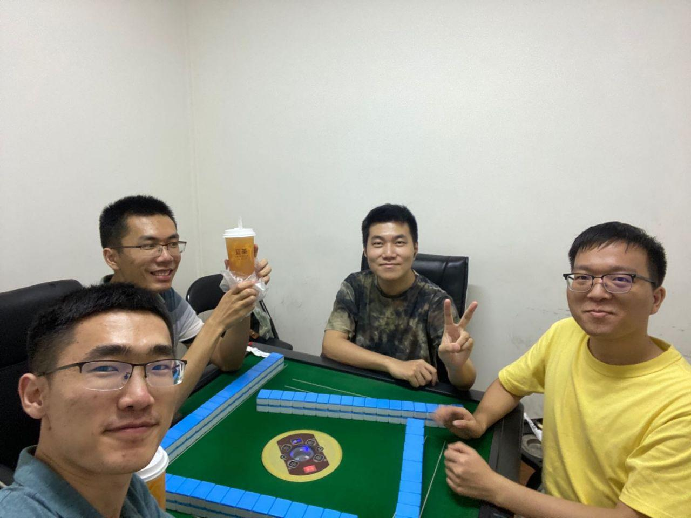

# Playing mahjong
2020/6/26

Yesterday Xinyi Tong suggested we can have an outside dinner together to celebrate the dragon
boot festival. This dinner party includes him, me, Fei Ma and Zhiyuan Wu. All are Ph.D. students of Lab 2c.

After some initial discussing, we agreed to eat "hot pot of beaf from Chaoshan". We chose a famous restaurant in the nearby of XiLi Metro Station. The other three came there from
the campus while I headed towards there from iPark.

We ordered some common recipes, talked causally and waited for the delicious food.
Xinyi is unique for his intelligence in Physics. He can explain something which is mystery for
the other three. For example, he is "expert" to prepare some hand-made apparatus for the eclipse. He can also tell the reason why the half with red soup can keep more water than the other half with white soup.

Xinyi said he felt it was ok to work 3 hours a day and did something he liked for other time.
We were astonished to hear about his expectation about yearly salary: "300,000 RMB is enough,
I think". He also told about the salary (1 million RMB per year) he was equivalent if he was to be "bought" by some powerful and rich lady.

After the dinner, at the suggestion of Xinyi, we went to one "card store" for the price of 25 RMB per hour. Here is the photo before we have the happy 3.5 hours campaign:

We went back when the clock hit another day. Since Zhiyuan and I had not applied for the
normal process of entering the campus, we too had to cross over some lower wall. Fortunately
there is no one inside when we went into the campus in such a way since it was quite late.