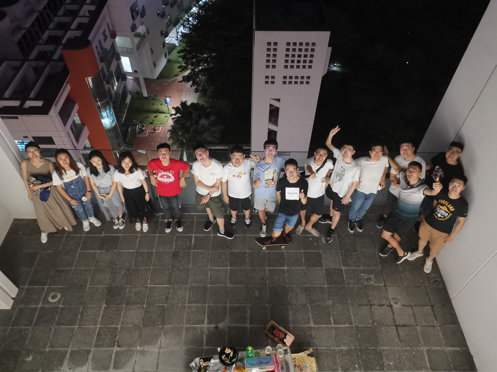

# first week after the double festival
The mid-autumn festival overlapped with the National holiday
this year. They are both at October first and this
phenomenon is called "celebrating the double festival".

An unforgettable activity was hosted by Xinyi Tong, during
which we appreciated the beautiful moon light and talked
leisurely on the open platform of 11th floor. A cultural
game called "Flowing flower ditty" was organized. Everyone
said one classical Chinese verses containing the character
"月" and no repeat is allowed. It became harder as common
verses are spoken out. Xiangxiang Xu even used some sentences from classical essays as a replacement. It is amazing that
the famous long poem called "春江花月夜" contained the exact
character almost every line. It seemed that only I and Xinyu
Liu, a postdoc student, had good memory on this long poem.
Finally I insisted to the last one by using some unfamiliar
verses. This game was out of my expectation. Contrary to my
tendency to arrange everything in advance, sometimes there is
more pleasure if some event happens out of your anticipation.

An intensive period of fourth year phd followed in recent days.
I focused much on current research while keeping learning foreign
languages. The dialog between I and Fei Ma became very few while
I was becoming more familiar with Weida Wang. The feeling between
Yang Bai and I became lighter as times goes on and I think we
should have regular meeting in order to overcome the tiredness.
