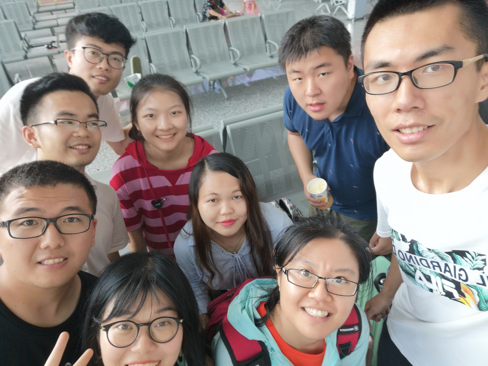
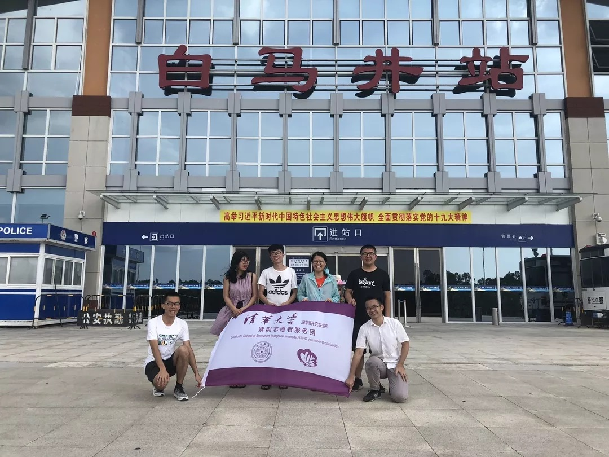
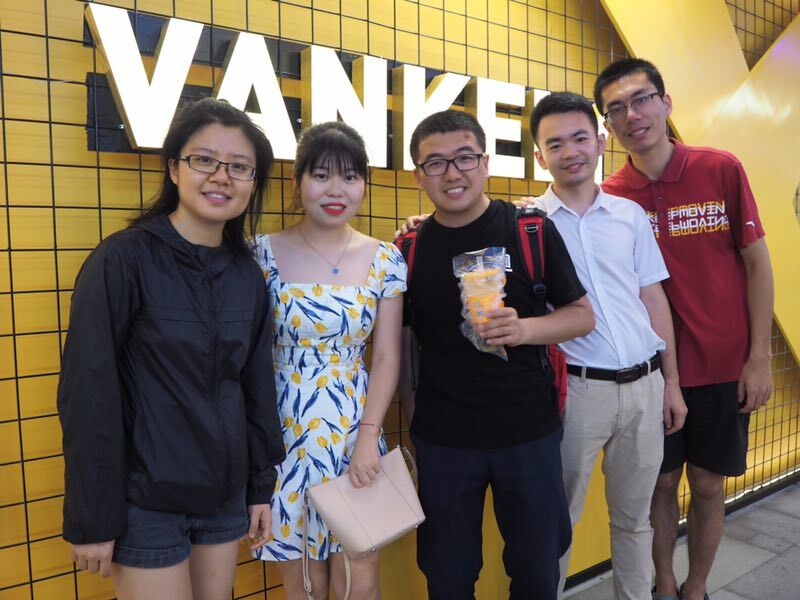

# Graduate
2020/5/26

It is amazing to memory those days when I have the unforgettable experience with those
8 partners.

When we are saying farewell at the station:

Then we have six students left, including me, all of whom are from Shenzhen Qinghua.

Time flies, then we have five students left:

At the graduation time, there are only 4 students:

Good luck to those who are exploring new life in new cities!

能够与 8 位小伙伴一起有过一段难忘的经历，在车站话别后，包括我在内的6位深圳的同学还能偶尔一聚，
但可惜有一位每次都不凑巧，直到毕业季也只是凑了4人局。祝各位在新的城市里探索新的美好生活~