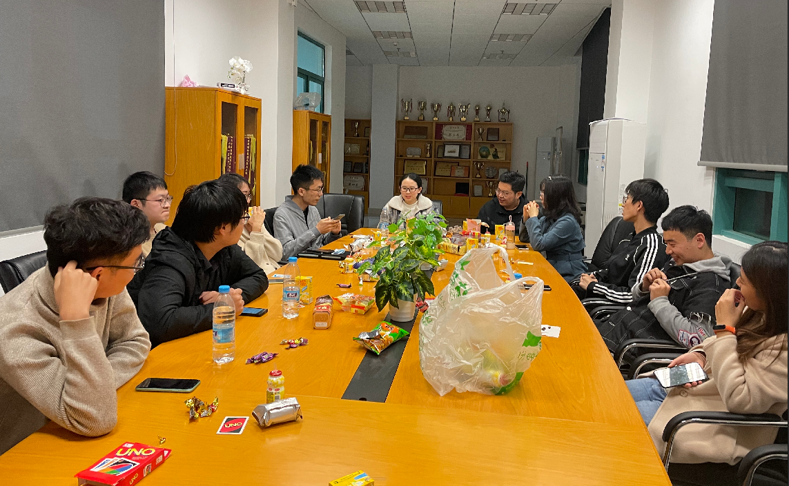

# Kartenspiele spielen

Heute Nacht hatte ich mit Freunde Kartenspiele gespielt.
Ihre chinesischen Namen werden im letzten Abschnitt gelistet.
Wir hatten drei Runden. Manche Studenten hatten Nachspeisen getragen.
Es gab viel Spaß bei uns.

Während wir spielten, ein Lehrer ins Zimmer kam. Er war nicht anderes als
Lehrer Liang. Er fragte: "Was hast du gemacht?" Wanda antwortet: "Wir haben Teambildung gemacht." Ich stand auf meinen Platz und begrüßte Lehrer Liang. Weida meinte, dass ich eine einflussreiche Person war.

Es ist speziell in diesem Moment, weil der neugierige Bedarf für die Rückkehr nach Hause, eingeführt wird. Es gilt, dass man Nukleinsäure Test Pflicht braucht, um Hause zurückzukehren.
Ich glaube, dass solche Maßnahmen nicht günstig ist.
Manche Studenten haben entschieden, dass sie morgen nach Hause fliegen, bevor die Maßnahmen wirksam werden.

## Note

### Die chinesischen Namen von Mitspielern
* 王伟达
* 李宛达
* 朱奕霏
* 张可
* 张安平
* 宋子午
* 朱勇赤
* 毛钰竹
* 杨絮
* 樊家硕
### Anderer Name
* Liang 梁大伟
