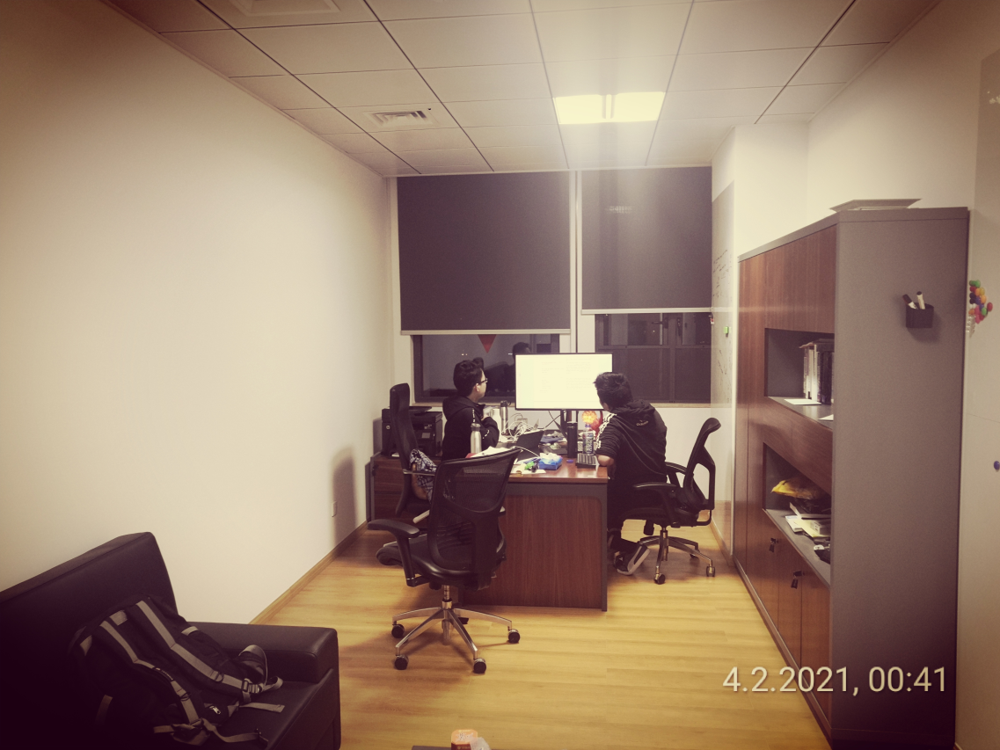

# New year is approaching
2021/2/5

I will be the first lunar new year I spent outside hometown. Wandering
through the campus, I found the atmosphere of celebration is near.
On both sides of the door of the McDonald's hangs the spring couplet.
Wishing sentences are written on red rectangular paper and are hung
from an old tree. It will be a warm festival in Shenzhen, I think.

There seem to be many students staying here this time. For our lab,
three doctor students will not come back including me. This is a quiet
festival and scheduled by one's free will. No more relatives to visit,
no more bothering if living with parents, but may be a lonely festival,
a festival of oneself.

Big brother Xiangxiang will come back to Jiangxi next week.
He assisted Xinyi to revise the ICML paper. Both of them stayed up for
a night with the pressure from professor Huang. I made a photo for such scene.

Weida seemed to be at leisure while others are busying with their research topic.
My deskmate, Weitao Tang, said he worried about his research products, though
he had obtained an offer of Kuaishou. Yi Yan, a fresh year PhD student of our lab,
was writing a new paper guided by his tutor, a foreign professor from Turkey called
Ercan.

Some professors of our lab will not come back to home either.
Professor Huang is Taiwanese and there is too much cost to go back and fro during
the pandemic period.

My preparation for TestDaF has some progress but it is still hard to reach
the skill level required by the exam.

