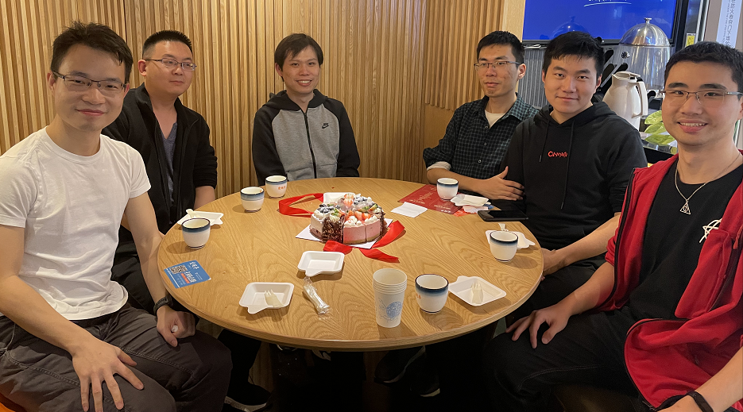

# Say good-bye to Sima
2021/2/2

Last night we had dinner together, since Jin Sima will go home and won't come back.
As a visiting student in our lab, Sima has spent his time with us for about half a year,
and we have good relationship with each other. Sima is going to finish his
PhD thesis in the spring semester and obtain his degree from Caltech.
However, due to visa restrictions, he has stayed in China
for one and a half year.

Today is also special since it is the birthday of Xiangxiang. So he bought a cake
and shares with us. Xiangxiang is working as research assistant in our lab. Originally,
he would go to MIT and work as a post-doctor. But the pandemic broke out and it becomes
very hard to go abroad.

Xinchun Yu is an old post-doctor in our lab. He came here last month and had a hard time
to get familiar with his research topic.

Xinyi Tong is my old friend. He recommended this Hunan cuisine restaurant.
He is quite out-going and thinks of the possibility to pursue his hobby in linguistics
when he has enough money in the future.

Weida Wang has abandoned his submission plan for the coming conference due to his inability to conduct computational experiment. Then he becomes obsessed with video games in recent days.

During the dinner, xiangxiang thought of the first line of an antithetical couplet:
"众口难调调众口". Xinyi thought it as a hard problem to give the second line.
After a while, Sima gave a solution: "春光乍现现春光." The next morning,
xiangxiang gave his own answer, "一言不发发一言" as the giving sentence to Sima. Then Sima
went away, leaving us behind. "Time flies. You guys will soon graduate." Ma said.
